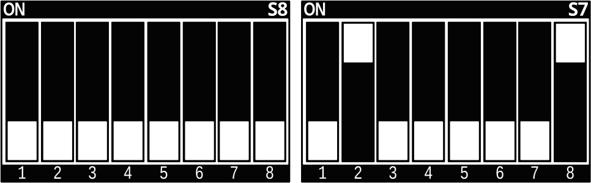

.. Download links
.. |dlpage-bsp| replace:: our BSP
.. _dlpage-bsp: https://www.phytec.de/bsp-download/?bsp=BSP-Yocto-Ampliphy-AM68x-PD24.1.0
.. |dlpage-bsp-link| replace:: |dlpage-bsp|_
.. |dlpage-product| replace:: https://www.phytec.de/produkte/system-on-modules/phycore-am68x-tda4x/#downloads
.. |dl-server| replace:: BSP downloads
.. _dl-server: https://download.phytec.de/Software/Linux/BSP-Yocto-AM68x/
.. |dl-server-link| replace:: |dl-server|_
.. |dl-sdk| replace:: SDK downloads
.. _dl-sdk: https://download.phytec.de/Software/Linux/BSP-Yocto-AM68x/BSP-Yocto-Ampliphy-AM68x-PD24.1.0/sdk/ampliphy-xwayland/
.. |dl-sdk-link| replace:: |dl-sdk|_
.. |link-image| replace:: https://download.phytec.de/Software/Linux/BSP-Yocto-AM68x/BSP-Yocto-Ampliphy-AM68x-PD24.1.0/images/ampliphy-xwayland/phyboard-izar-am68x-2/phytec-qt5demo-image-phyboard-izar-am68x-2.wic.xz
.. |link-partup-package| replace:: https://download.phytec.de/Software/Linux/BSP-Yocto-AM68x/BSP-Yocto-Ampliphy-AM68x-PD24.1.0/images/ampliphy-xwayland/phyboard-izar-am68x-2/phytec-qt5demo-image-phyboard-izar-am68x-2.partup
.. |link-boot-tools| replace:: https://download.phytec.de/Software/Linux/BSP-Yocto-AM68x/BSP-Yocto-Ampliphy-AM68x-PD24.1.0/images/ampliphy-xwayland/phyboard-izar-am68x-2/
.. |link-bsp-images| replace:: https://download.phytec.de/Software/Linux/BSP-Yocto-AM68x/BSP-Yocto-Ampliphy-AM68x-PD24.1.0/images/ampliphy-xwayland/phyboard-izar-am68x-2/
.. _releasenotes: https://git.phytec.de/phy2octo/tree/releasenotes?h=AM68x
.. _`static-pdf-dl`: ../../../_static/am68x-head.pdf

.. AM68x specific

.. General Substitutions
.. |doc-id| replace:: Head
.. |kit| replace:: **phyCORE-AM68x/TDA4x Kit**
.. |kit-ram-size| replace:: 2x2GiB
.. |sbc| replace:: phyBOARD-Izar
.. |soc| replace:: AM68x/TDA4x
.. |socfamily| replace:: AM68
.. |som| replace:: phyCORE-|soc|
.. |debug-uart| replace:: ttyS0
.. |serial-uart| replace:: ttyS2
.. |rs232-uart| replace:: ttyS3
.. |expansion-connector| replace:: X38
.. |vendor| replace:: TI

.. Linux Kernel
.. |kernel-defconfig| replace:: phytec_ti_defconfig
.. |kernel-recipe-path| replace:: meta-phytec/recipes-kernel/linux/linux-phytec-ti_*.bb
.. |kernel-repo-name| replace:: linux-phytec-ti
.. |kernel-repo-url| replace:: https://github.com/phytec/linux-phytec-ti
.. |kernel-socname| replace:: am68x
.. |kernel-tag| replace:: v6.12.35-11.01.05-phy
.. |emmcdev| replace:: mmcblk0
.. |led-names| replace:: user-led1, user-led2 and user-led3
.. |led-example| replace:: user-led1

.. Bootloader
.. |u-boot-a72-defconfig| replace:: phycore_am68x_a72_defconfig
.. |u-boot-r5-defconfig| replace:: phycore_am68x_r5_defconfig
.. |bootloader-offset| replace:: 32
.. |u-boot-mmc-flash-offset| replace:: 0x40
.. |u-boot-emmc-devno| replace:: 0
.. |u-boot-recipe-path| replace:: meta-phytec/recipes-bsp/u-boot/u-boot-phytec-ti_*.bb
.. |u-boot-repo-name| replace:: u-boot-phytec-ti
.. |u-boot-repo-url| replace:: https://github.com/phytec/u-boot-phytec-ti
.. |emmcdev-uboot| replace:: mmc 0
.. |sdcarddev-uboot| replace:: mmc 1

.. AM68x specific
.. |u-boot-socname-config| replace:: PHYCORE_AM68X_A72
.. |u-boot-tag| replace:: 11.01.02

.. RAUC
.. |rauc-manual| replace:: L-1006e.A6 RAUC Update & Device Management Manual
.. _rauc-manual: https://www.phytec.de/cdocuments/?doc=F4DiM

.. Devicetree
.. |dt-carrierboard| replace:: k3-am68-phyboard-izar
.. |dt-som| replace:: k3-am68-phycore-som

.. AM68x specific
.. |dt-somnetwork| replace:: :linux-phytec-ti:`tree/v6.12.35-11.01.05-phy/arch/arm64/boot/dts/ti/k3-am68-phycore-som.dtsi#L326`

.. |dt-gpio-expander| replace:: :linux-phytec-ti:`tree/v6.12.35-11.01.05-phy/arch/arm64/boot/dts/ti/k3-am68-phyboard-izar.dts#L310`

.. Yocto
.. |yocto-bootenv-link| replace:: :yocto-bootenv:`scarthgap`
.. |yocto-bsp-name| replace:: BSP-Yocto-AM68x
.. _yocto-bsp-name: `dl-server`_
.. |yocto-codename| replace:: scarthgap
.. |yocto-distro| replace:: ampliphy-xwayland
.. |yocto-imagename| replace:: phytec-qt5demo-image
.. |yocto-imageext| replace:: wic.xz
.. |yocto-machinename| replace:: phyboard-izar-am68x-2
.. |yocto-manifestname| replace:: BSP-Yocto-Ampliphy-AM68x-PD24.1.0
.. |yocto-manifestname-master| replace:: BSP-Yocto-Ampliphy-AM68x-master
.. |yocto-manifestname-y| replace:: BSP-Yocto-Ampliphy-AM68x-PD24.1.y
.. |yocto-ref-manual| replace:: :ref:`Yocto Reference Manual (scarthgap) <yocto-man-scarthgap>`
.. |yocto-ref-manual-kernel-and-bootloader-conf| replace:: :ref:`Yocto Reference Manual <yocto-man-scarthgap-kernel-and-bootloader-conf>`
.. |yocto-sdk-rev| replace::  BSP-Yocto-Ampliphy-AM68x-PD24.1.0
.. |yocto-sdk-a-core| replace:: aarch64

.. Ref Substitutions
.. |ref-bootswitch| replace:: :ref:`bootmode switches (S7 & S8) <am68x-head-bootswitch>`
.. |ref-bsp-images| replace:: :ref:`BSP Images <am68-head-images>`
.. |ref-debugusbconnector| replace:: :ref:`(X64) <am68x-head-components>`
.. |ref-dt| replace:: :ref:`device tree <am68x-head-device-tree>`
.. |ref-getting-started| replace:: :ref:`Getting Started <am68x-head-getting-started>`
.. |ref-network| replace:: :ref:`Network Environment Customization <am68x-head-network>`
.. |ref-setup-network-host| replace:: :ref:`Setup Network Host <am68x-head-development>`
.. |ref-usb-otg| replace:: :ref:`X18 <am68x-head-components>`
.. |ref-build-uboot| replace:: :ref:`Build U-Boot <am68x-head-development-build-uboot>`
.. |ref-format-sd| replace:: :ref:`Resizing ext4 Root Filesystem  <am68x-head-format-sd>`

.. AM68x specific
.. |sbc-network| replace::
   The device tree set up for CPSW2G Ethernet IP core where the PHY is populated
   on the |sbc| can be found here:
   :linux-phytec-ti:`tree/v6.12.35-11.01.05-phy/arch/arm64/boot/dts/ti/k3-am68-phyboard-izar.dts#L288`.

.. |ref-serial| replace:: :ref:`X27 <am68x-head-components>`
.. |ref-S5| replace:: :ref:`S5 <am68x-head-components>`
.. |ubootexternalenv| replace:: U-boot External Environment subsection of the
   :ref:`device tree overlay section <am68x-head-ubootexternalenv>`
.. |weston-hdmi-mode| replace:: preferred
.. |eeprom-detect-bus| replace:: 1
.. |eeprom-detect-addr| replace:: 0x50
.. |eeprom-som-detect-area| replace:: 256
.. |eeprom-som-detect-area-hex| replace:: 0x100

.. |gpio-number-of-banks| replace:: 9
.. |gpio-per-bank| replace:: 16
.. |gpio-per-bank-1| replace:: 15
.. |gpio-sysfs-list| replace:: gpiochip0 and gpiochip1

.. only:: html

   Documentation in pdf format: `Download <static-pdf-dl_>`_

+-----------------------+----------------------+
| |doc-id| |soc|        |                      |
| BSP Manual Head       |                      |
+-----------------------+----------------------+
| Document Title        | |doc-id| |soc|       |
|                       | BSP Manual Head      |
+-----------------------+----------------------+
| Document Type         | BSP Manual           |
+-----------------------+----------------------+
| Article Number        | |doc-id|             |
+-----------------------+----------------------+
| Yocto Manual          | Scarthgap            |
+-----------------------+----------------------+
| Release Date          | XXXX/XX/XX           |
+-----------------------+----------------------+
| Is Branch of          | |doc-id| |soc|       |
|                       | BSP Manual Head      |
+-----------------------+----------------------+

The table below shows the Compatible BSPs for this manual:

================ ================ ================= ==========
Compatible BSPs  BSP Release Type BSP Release  Date BSP Status

================ ================ ================= ==========
..
================ ================ ================= ==========

.. include:: /bsp/intro.rsti

Supported Hardware
------------------

On our web page, you can see all supported Machines with the available Article
Numbers for this release: |yocto-manifestname| `download <dlpage-bsp_>`_.

If you choose a specific **Machine Name** in the section **Supported Machines**,
you can see which **Article Numbers** are available under this machine and also
a short description of the hardware information. In case you only have
the **Article Number** of your hardware, you can leave the **Machine
Name** drop-down menu empty and only choose your **Article Number**. Now it
should show you the necessary **Machine Name** for your specific hardware

.. _am68x-head-components:
.. include:: components.rsti

.. +---------------------------------------------------------------------------+
.. Getting Started
.. +---------------------------------------------------------------------------+

.. _am68x-head-getting-started:
.. include:: /bsp/getting-started.rsti

First Start-up
--------------

*  To boot from an SD card, the |ref-bootswitch| needs to be set to the following
   position:

*  Insert the SD card
*  Connect the target and the host with **micro USB** on |ref-debugusbconnector|
   debug USB
*  Power up the board

.. +---------------------------------------------------------------------------+
.. Building the BSP
.. +---------------------------------------------------------------------------+

.. include:: /bsp/building-bsp.rsti
   :end-before: .. nxp-eula-marker
.. include:: /bsp/building-bsp.rsti
   :start-after: .. nxp-eula-marker

.. _am68-head-images:

*  **tiboot3.bin**:
   The first bootloader image, loaded by the boot ROM, contains both the AM68x's
   Device Management & Security Controller (DMSC) firmware and the Cortex-R5
   Secondary Bootloader (SPL).
*  **tispl.bin**:
   The second bootloader image, loaded by the R5 SPL, contains the ARM Trusted
   Firmware (ATF), Open Portable Trusted Execution Environment (OPTEE) and the
   Cortex-A72 SPL.
*  **u-boot.img**:
   Bootloader for Cortex-A72 Linux and for other software destined for the Cortex-R5 cores.
*  **Image**: Linux kernel image
*  **k3-am68-phyboard-izar-rdk.dtb**: Kernel device tree file
*  **k3-am68-phyboard-izar-*.dtbo**: Kernel device tree overlay files
*  **phytec-qt5demo-image-phyboard-izar-am68x-2.tar.xz**: Root file system
*  **phytec-qt5demo-image-phyboard-izar-am68x-2.wic.xz**: SD card image

.. +---------------------------------------------------------------------------+
.. INSTALLING THE OS
.. +---------------------------------------------------------------------------+

Installing the OS
=================

Bootmode Switches (S7 & S8)
---------------------------

.. tip::

   Hardware revision baseboard: 1618.1

The |sbc| features two boot switches, each with eight individually switchable
ports to select the |som| default bootsource.

.. _am68x-head-bootswitch:
.. include:: bootmode-switch.rsti

.. include:: /bsp/ti-common/installing-os.rsti
   :end-before: .. rauc-marker

.. +---------------------------------------------------------------------------+
.. DEVELOPMENT
.. +---------------------------------------------------------------------------+

.. _am68x-head-development:

Development
===========

.. include:: /bsp/ti-common/development/standalone_build_preface.rsti

.. warning::
   Using the SDK on older host distributions (e.g., Ubuntu 20.04 LTS) with Scarthgap TI-based BSPs
   can cause issues when building U-Boot or Linux kernel tools for host use. If you encounter an
   "undefined reference" error, a workaround is to prepend the host's binutils to the PATH.

   .. code-block:: console

      host$ export PATH=/usr/bin:$PATH

   Run this after sourcing the SDK *environment-setup* file.

   Note, SDK issue has not been observed on newer distributions, such as Ubuntu 22.04, which appear to work
   without requiring any modifications.

.. _am68x-head-development-build-uboot:
.. include:: /bsp/ti-common/development/standalone_build_u-boot_binman.rsti
   :end-before: .. get-binaries-marker
Get the needed binaries
.......................

To build the bootloader, you need to **copy** these **files** to your |u-boot-repo-name|
**build directory** and rename them to fit with *binman* script:

*  **ARM Trusted firmware binaries**:
      * bl31.bin
      * other firmware files

If you already built our BSP with Yocto, you can get bl31.bin and the required
firmware files from the directory mentioned here: |ref-bsp-images|

Alternatively, these firmware files are also available in
the ti-linux-firmware repository.

Or you can download the files here: |link-boot-tools|

.. warning::

   Make sure you rename the files you need so that they are compatible with the
   *binman tool*.

Build the bootloader
....................

Build tiboot3.bin, tispl.bin and u-boot.img:

- R5 core:

   .. code-block:: console
      :substitutions:

      host:~/|u-boot-repo-name|$ make |u-boot-r5-defconfig|
      host:~/|u-boot-repo-name|$ make BINMAN_INDIRS=/path/to/firmware_files

- A72 core:

   .. code-block:: console
      :substitutions:

      host:~/|u-boot-repo-name|$ make |u-boot-a72-defconfig|
      host:~/|u-boot-repo-name|$ make BL31=/path/to/bl31.bin BINMAN_INDIRS=/path/to/firmware_files TEE=/path/to/tee-raw.bin

.. include:: /bsp/ti-common/development/standalone_build_u-boot_binman.rsti
   :start-after: .. get-binaries-marker
   :end-before: .. build-uboot-fixed-ram-size-marker
.. include:: /bsp/ti-common/development/standalone_build_kernel.rsti

.. include:: /bsp/development/host_network_setup.rsti
.. include:: /bsp/ti-common/development/netboot.rsti

.. include:: /bsp/development/development_manifests.rsti

.. include:: /bsp/development/master_manifest.rsti

.. _am68x-head-format-sd:

.. include:: /bsp/development/format_sd-card.rsti

.. +---------------------------------------------------------------------------+
.. DEVICE TREE
.. +---------------------------------------------------------------------------+

.. _am68x-head-device-tree:
.. include:: /bsp/device-tree.rsti

.. code-block::
   :substitutions:

   k3-am68-phyboard-izar-lvds-ac200.dtbo
   k3-am68-phyboard-izar-pwm-fan.dtbo
   k3-am68-phyboard-izar-vm016-mipi-csi0.dtbo
   k3-am68-phyboard-izar-vm016-mipi-csi1.dtbo
   k3-am68-phyboard-izar-vm017-mipi-csi0.dtbo
   k3-am68-phyboard-izar-vm017-mipi-csi1.dtbo
   k3-am68-phyboard-izar-vm020-mipi-csi0.dtbo
   k3-am68-phyboard-izar-vm020-mipi-csi1.dtbo

.. _am68x-head-ubootexternalenv:
.. include:: /bsp/dt-overlays.rsti

.. +---------------------------------------------------------------------------+
.. ACCESSING PERIPHERALS
.. +---------------------------------------------------------------------------+

.. include:: /bsp/peripherals/introduction.rsti

.. include:: /bsp/peripherals/pin-muxing.rsti

The following is an example of the pin muxing of the UART0 device in
|dt-carrierboard|.dts:

.. code-block::

   mcu_uart0_pins_default: mcu-uart0-default-pins {
      pinctrl-single,pins = <
         J721S2_WKUP_IOPAD(0x090, PIN_INPUT, 0) /* (B24) WKUP_GPIO0_14.MCU_UART0_CTSn */
         J721S2_WKUP_IOPAD(0x094, PIN_OUTPUT, 0) /* (D25) WKUP_GPIO0_15.MCU_UART0_RTSn */
         J721S2_WKUP_IOPAD(0x08c, PIN_INPUT, 0) /* (C24) WKUP_GPIO0_13.MCU_UART0_RXD */
         J721S2_WKUP_IOPAD(0x088, PIN_OUTPUT, 0) /* (C25) WKUP_GPIO0_12.MCU_UART0_TXD */
      >;
   };

The first argument of the macro J721S2_IOPAD(pa, val, muxmode) is the pad offset
address within the I/O controller (in this example 0x08c, corresponding UART0_RXD).
The second argument (val) specifies the pad configuration, such as input/output
and pull-up/pull-down. Third argument (muxmode) selects the functional mux mode
for the pad, i.e. which peripheral signal is connected to it. In this case, 0
corresponds to the default mux option for UART0.

The device tree representation for UART0 pinmuxing:
:linux-phytec-ti:`tree/v6.12.35-11.01.05-phy/arch/arm64/boot/dts/ti/k3-am68-phyboard-izar.dts#L265`

RS232
-----

The AM68x/TDA4x SoC provides up to 12 UART units. On the |sbc|, TTL level signals
of UART8 (the standard console) and WKUP_UART0 are routed to a FT2232H UART
to USB converter expansion. This USB is brought out at micro USB connector X64.
UART1 is connected to a multi-protocol transceiver for RS-232 and RS-485,
available at pin header connector |ref-serial| at the RS-232 level,
or at the RS-485 level. The muxing of the used transceivers is done by pin 1 of
PCA9672BS GPIO expansion IC on the baseboard (RS485/nRS232_EN).
For more information about the correct setup please refer to the |som|/|sbc|
Hardware Manual section UARTs.

*  Display the current settings of a terminal in a human-readable format:

   .. code-block:: console

      target:~$ stty -a

*  With a simple echo and cat, basic communication can be tested. Example:

   .. code-block:: console
      :substitutions:

      target:~$ echo 123 > /dev/|rs232-uart|

   .. code-block:: console

      host:~$ cat /dev/ttyUSB2

The device tree representation for RS232:
:linux-phytec-ti:`tree/v6.12.35-11.01.05-phy/arch/arm64/boot/dts/ti/k3-am68-phyboard-izar.dts#L400`

.. _am68x-head-network:

Network
-------

|sbc|-|soc| provides two ethernet interfaces. A gigabit Ethernet is provided by our
module and board.

.. warning::

   The naming convention of the Ethernet interfaces in the hardware (ETH0
   and ETH1) do not align with the network interfaces (end0 and end1) in
   Linux. So, be aware of these differences:

   | ETH1 = end0
   | ETH0 = end1

.. include:: /bsp/peripherals/network.rsti
   :end-before: .. kernel-network-environment-marker

Secondary Ethernet Interface Configuration in U-Boot
^^^^^^^^^^^^^^^^^^^^^^^^^^^^^^^^^^^^^^^^^^^^^^^^^^^^

By default, U-Boot utilizes the Ethernet PHY located on the module. To use the network connection
provided by the PHY on the carrier board, configuration changes are required.

To enable the secondary Ethernet interface in U-Boot, the active Ethernet connection must be
adjusted. The IP address configuration in U-Boot may also need modification.

Configure the development host with IP address 192.168.4.10 and netmask 255.255.255.0. The target
device must then be configured as follows:

.. code-block::

    u-boot=> setenv ethact end1
    u-boot=> setenv ipaddr 192.168.4.11

.. include:: /bsp/peripherals/network.rsti
   :start-after: .. kernel-network-environment-marker

.. include:: /bsp/peripherals/sd-card.rsti

DT configuration for the MMC (SD card slot) interface can be found here:
:linux-phytec-ti:`tree/v6.12.35-11.01.05-phy/arch/arm64/boot/dts/ti/k3-am68-phycore-som.dtsi#L403`
and
:linux-phytec-ti:`tree/v6.12.35-11.01.05-phy/arch/arm64/boot/dts/ti/k3-am68-phyboard-izar.dts#L377`

DT configuration for the e.MMC interface can be found here:
:linux-phytec-ti:`tree/v6.12.35-11.01.05-phy/arch/arm64/boot/dts/ti/k3-am68-phycore-som.dtsi#L395`

.. include:: emmc.rsti

.. include:: ../peripherals/spi-master.rsti
  :end-before: .. peripherals-spi-nor-flash-marker

.. include:: ../peripherals/spi-nor-flash-no-boot.rsti

The definition of the SPI master node in the device tree can be found here:

:linux-phytec-ti:`tree/v6.12.35-11.01.05-phy/arch/arm64/boot/dts/ti/k3-am68-phyboard-izar.dts#L385`

.. include:: gpios.rsti

.. include:: /bsp/peripherals/leds.rsti

Device tree configuration for the User I/O configuration can be found here:
:linux-phytec-ti:`tree/v6.12.35-11.01.05-phy/arch/arm64/boot/dts/ti/k3-am68-phyboard-izar.dts#L552`

.. include:: /bsp/peripherals/i2c-bus.rsti

General I²C bus configuration from SoM (e.g. |dt-som|.dtsi):
:linux-phytec-ti:`tree/v6.12.35-11.01.05-phy/arch/arm64/boot/dts/ti/k3-am68-phycore-som.dtsi#L346`

General I²C bus configuration from carrierboard (e.g. |dt-carrierboard|.dts)
:linux-phytec-ti:`tree/v6.12.35-11.01.05-phy/arch/arm64/boot/dts/ti/k3-am68-phyboard-izar.dts#L305`

EEPROM
------

The system features tree I2C EEPROM devices distributed across the SoM and
carrier board:

On the |som| SoM:

*  Board Detection EEPROM

   *  Bus: I2C-0
   *  Address: 0x50
   *  Purpose: Factory configuration for board identification
*  Board Detection EEPROM

   *  Bus: I2C-0
   *  Address: 0x51
   *  Purpose: Available for user applications

Device Tree Reference for SoM EEPROMs:
:linux-phytec-ti:`tree/v6.12.35-11.01.05-phy/arch/arm64/boot/dts/ti/k3-am68-phycore-som.dtsi#L589`

And on the |sbc| carrier board:

*  Board Detection EEPROM

   *  Bus: I2C-0
   *  Address: 0x57
   *  Purpose: Reserved for carrier board identification

Device Tree Reference for Carrier Board:
:linux-phytec-ti:`tree/v6.12.35-11.01.05-phy/arch/arm64/boot/dts/ti/k3-am68-phyboard-izar.dts#L546`

.. include:: /bsp/peripherals/eeprom.rsti

.. include:: /bsp/peripherals/rtc.rsti

DT representation for I²C RTCs:
:linux-phytec-ti:`tree/v6.12.35-11.01.05-phy/arch/arm64/boot/dts/ti/k3-am68-phycore-som.dtsi#L360`

And the addions on the carrierboard:
:linux-phytec-ti:`tree/v6.12.35-11.01.05-phy/arch/arm64/boot/dts/ti/k3-am68-phyboard-izar.dts#L301`

USB Host Controller
-------------------

The USB controller of the |soc| SoC provides a low-cost connectivity solution
for numerous consumer portable devices by providing a mechanism for data
transfer between USB devices with a line/bus speed of up to 5 Gbit/s (SuperSpeed
'SS'). The USB subsystem has one USB controller core that is capable of acting
as a USB peripheral device or a USB host and is connected to a USB 3.1 PHY.

.. include:: /bsp/peripherals/usb-host.rsti

DT representation for USB Host:
:linux-phytec-ti:`tree/v6.12.35-11.01.05-phy/arch/arm64/boot/dts/ti/k3-am68-phyboard-izar.dts#L530`

.. include:: /bsp/peripherals/usb-device.rsti

CAN FD
------

The |sbc| has four CAN interfaces supporting CAN FD. They are supported by the
Linux standard CAN framework which builds upon then the Linux network layer.
Using this framework, the CAN interfaces behave like an ordinary Linux network
device, with some additional features special to CAN. More information can be
found in the Linux Kernel
documentation: https://www.kernel.org/doc/html/latest/networking/can.html

.. include:: ../peripherals/canfd.rsti

Device Tree CAN configuration of |dt-carrierboard|.dts:
:linux-phytec-ti:`tree/v6.12.35-11.01.05-phy/arch/arm64/boot/dts/ti/k3-am68-phyboard-izar.dts#L355`

Camera
------

To support a phyCAM-M |sbc| the Device Tree overlay has to be enabled and
the camera needs to be initialized, e.g. a VM-016 on CSI1 (x55):

- Enable the overlay and reboot the board:

.. code-block:: console

   target:~$ vi /boot/bootenv.txt
   overlays=k3-am68-phyboard-izar-lvds-ac200.dtbo k3-am68-phyboard-izar-pwm-fan.dtbo k3-am68-phyboard-izar-vm016-mipi-csi1.dtbo
   target:~$ reboot

- Check if the camera has been loaded:

.. code-block:: console

   target:~$ media-ctl --device 0 --print-topology

- Setup the camera:

.. code-block:: console

   target:~$ setup-pipeline-csi -i 0 -f SGRBG8_1X8 -s 1280x800 -o "(0,4)" -c 1280x800 -v

- To start a camera stream using the LVDS Display, launch a GStreamer pipeline for example:

.. code-block:: console

   target:~$ systemctl stop phytec-qtdemo
   target:~$ systemctl stop weston
   target:~$ gst-launch-1.0 v4l2src device=/dev/video2 ! video/x-bayer, width=1280, height=800, format=grbg ! bayer2rgb ! videoconvert ! kmssink sync=false driver-name=tidss force-modesetting=true

.. include:: /bsp/peripherals/video.rsti

.. include:: display.rsti

.. include:: /bsp/qt5.rsti

.. include:: /bsp/peripherals/display.rsti

.. include:: /bsp/am6x/peripherals/pm.rsti

.. include:: /bsp/peripherals/tm.rsti

Temperature Sensors
...................

The |som| has two temperature sensors connected via I2C bus. They can be
accessed via the hwmon interface. Temperature in millicelsius can be read from
the following sysfs entries:

.. code-block:: console

   target:~$ cat /sys/class/hwmon/hwmon0/temp1_input
   53937
   target:~$ cat /sys/class/hwmon/hwmon1/temp1_input
   53250

PWM Fan
........

A PWM fan can be connected to the |sbc|-|soc|. It cannot be controlled by the
kernel. We use lmsensors with hwmon for this instead. lmsensors reads the
temperature periodically and adjusts the fan speed according to the fan curve.
Default configuration is set to keep the SoC at 60°C

The settings can be configured in the configuration file:

.. code-block::

   /etc/fancontrol

Fan control is started by a systemd service during boot. This can be disabled
with:

.. code-block:: console

   target:~$ systemctl disable fancontrol

.. include:: /bsp/peripherals/watchdog.rsti
