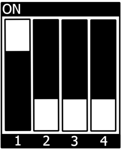

.. Download links
.. |dlpage-bsp| replace:: our BSP
.. _dlpage-bsp: https://www.phytec.de/bsp-download/?bsp=BSP-Yocto-NXP-i.MX8MP-PD26.1.0
.. |dlpage-bsp-link| replace:: |dlpage-bsp|_
.. |dlpage-product| replace:: https://www.phytec.de/produkte/system-on-modules/phycore-imx-8m-plus-fpsc/#downloads
.. |dl-server| replace:: BSP downloads
.. _dl-server: https://download.phytec.de/Software/Linux/BSP-Yocto-i.MX8MP/
.. |dl-server-link| replace:: |dl-server|_
.. |dl-sdk| replace:: SDK downloads
.. _dl-sdk: https://download.phytec.de/Software/Linux/BSP-Yocto-i.MX8MP/BSP-Yocto-NXP-i.MX8MP-PD26.1.0/sdk/ampliphy-vendor/
.. |dl-sdk-link| replace:: |dl-sdk|_
.. |link-image| replace:: https://download.phytec.de/Software/Linux/BSP-Yocto-i.MX8MP/BSP-Yocto-NXP-i.MX8MP-PD26.1.0/images/ampliphy-vendor/imx8mp-libra-fpsc-1/phytec-qt6demo-image-imx8mp-libra-fpsc-1.rootfs.wic.xz
.. |link-partup-package| replace:: https://download.phytec.de/Software/Linux/BSP-Yocto-i.MX8MP/BSP-Yocto-NXP-i.MX8MP-PD26.1.0/images/ampliphy-vendor/imx8mp-libra-fpsc-1/phytec-qt6demo-image-imx8mp-libra-fpsc-1.rootfs.partup
.. |link-boot-tools| replace:: https://download.phytec.de/Software/Linux/BSP-Yocto-i.MX8MP/BSP-Yocto-NXP-i.MX8MP-PD26.1.0/images/ampliphy-vendor/imx8mp-libra-fpsc-1/imx-boot-tools/
.. |link-bsp-images| replace:: https://download.phytec.de/Software/Linux/BSP-Yocto-i.MX8MP/BSP-Yocto-NXP-i.MX8MP-PD26.1.0/images/ampliphy-vendor/imx8mp-libra-fpsc-1/
.. _releasenotes: https://git.phytec.de/phy2octo/tree/releasenotes?h=imx8mp
.. _`static-pdf-dl`: ../../../_static/imx8mp-fpsc-head.pdf

.. IMX8(MP) specific

.. General Substitutions
.. |doc-id| replace:: Head
.. |kit| replace:: **phyCORE-i.MX 8M Plus FPSC Kit**
.. |kit-ram-size| replace:: 2GiB
.. |sbc| replace:: Libra FPSC
.. |soc| replace:: i.MX 8M Plus
.. |socfamily| replace:: i.MX 8
.. |som| replace:: phyCORE-|soc| FPSC
.. |debug-uart| replace:: ttymxc3
.. |serial-uart| replace:: ttymxc2
.. |bluetooth-uart| replace:: UART3
.. |expansion-connector| replace:: X6
.. |netboot-script| replace:: net_boot_fit.scr.uimg

.. Linux Kernel
.. |kernel-defconfig| replace:: imx8_phytec_defconfig
.. |kernel-recipe-path| replace:: meta-phytec/recipes-kernel/linux/linux-phytec-imx_*.bb
.. |kernel-repo-name| replace:: linux-phytec-imx
.. |kernel-repo-url| replace:: https://github.com/phytec/linux-phytec-imx
.. |kernel-socname| replace:: imx8mp-fpsc
.. |kernel-tag| replace:: v6.12.20-2.0.0-phyX
.. |emmcdev| replace:: mmcblk2
.. |led-names| replace:: red:user1, green:user2 and blue:user3
.. |led-example| replace:: red\\:user1

.. Bootloader
.. |u-boot-defconfig| replace:: imx8mp-libra_defconfig
.. |bootloader-offset| replace:: 32
.. |bootloader-offset-boot-part| replace:: 0
.. |u-boot-mmc-flash-offset| replace:: 0x40
.. |u-boot-emmc-devno| replace:: 2
.. |u-boot-recipe-path| replace:: meta-phytec/recipes-bsp/u-boot/u-boot-phytec-imx_*.bb
.. |u-boot-repo-name| replace:: u-boot-phytec-imx
.. |u-boot-repo-url| replace:: https://github.com/phytec/u-boot-phytec-imx
.. |emmcdev-uboot| replace:: mmc 2
.. |sdcarddev-uboot| replace:: mmc 1

.. IMX8(MP) specific
.. |u-boot-socname-config| replace:: IMX8MP_LIBRA
.. |u-boot-tag| replace:: v2025.04-2.0.0-phyX

.. RAUC
.. |rauc-manual| replace:: L-1006e.A6 RAUC Update & Device Management Manual
.. _rauc-manual: https://www.phytec.de/cdocuments/?doc=F4DiM

.. Devicetree
.. |dt-carrierboard| replace:: imx8mp-libra-rdk-fpsc
.. |dt-som| replace:: imx8mp-phycore-fpsc

.. IMX8(MP) specific
.. |dt-somnetwork| replace:: :linux-phytec-imx:`tree/v6.12.20-2.0.0-phy1/arch/arm64/boot/dts/freescale/imx8mp-phycore-fpsc.dtsi#L82`
   `
.. |dt-somnetwork-link| replace:: |dt-somnetwork|
.. |dt-gpio-expander| replace:: :linux-phytec-imx:`tree/v6.12.20-2.0.0-phy1/arch/arm64/boot/dts/freescale/imx8mp-libra-rdk-fpsc.dts#L192`

.. Yocto
.. |yocto-bootenv-link| replace:: :yocto-bootenv:`walnascar`
.. |yocto-bsp-name| replace:: BSP-Yocto-IMX8MP-FPSC
.. _yocto-bsp-name: `dl-server`_
.. |yocto-codename| replace:: walnascar
.. |yocto-distro| replace:: ampliphy-vendor-xwayland
.. |yocto-imagename| replace:: phytec-qt6demo-image
.. |yocto-imageext| replace:: rootfs.wic.xz
.. |yocto-machinename| replace:: imx8mp-libra-fpsc-1
.. |yocto-manifestname| replace:: BSP-Yocto-NXP-i.MX8MP-PD26.1.0
.. |yocto-manifestname-master| replace:: BSP-Yocto-Ampliphy-i.MX8MP-master
.. |yocto-manifestname-y| replace:: BSP-Yocto-NXP-i.MX8MP-PD26.1.y
.. |yocto-ref-manual| replace:: :ref:`Yocto Reference Manual (walnascar) <yocto-man-master>`
.. |yocto-ref-manual-kernel-and-bootloader-conf| replace:: :ref:`Yocto Reference Manual <yocto-man-master-kernel-and-bootloader-conf>`
.. |yocto-sdk-rev| replace::  5.2.x
.. |yocto-sdk-a-core| replace:: cortexa53-crypto

.. Ref Substitutions
.. |ref-bootswitch| replace:: :ref:`bootmode switch (S1) <imx8mp-fpsc-head-bootswitch>`
.. |ref-bsp-images| replace:: :ref:`BSP Images <imx8mp-fpsc-head-images>`
.. |ref-debugusbconnector| replace:: :ref:`(X14) <imx8mp-fpsc-head-components>`
.. |ref-dt| replace:: :ref:`device tree <imx8mp-fpsc-head-device-tree>`
.. |ref-supported-hardware| replace:: :ref:`Supported Hardware <imx8mp-fpsc-head-supported-hardware>`
.. |ref-getting-started| replace:: :ref:`Getting Started <imx8mp-fpsc-head-getting-started>`
.. |ref-network| replace:: :ref:`Network Environment Customization <imx8mp-fpsc-head-network>`
.. |ref-setup-network-host| replace:: :ref:`Setup Network Host <imx8mp-fpsc-head-development>`
.. |ref-usb-otg| replace:: :ref:`X18 <imx8mp-fpsc-head-components>`
.. |ref-build-uboot| replace:: :ref:`Build U-Boot <imx8mp-fpsc-head-development-build-uboot>`
.. |ref-format-sd| replace:: :ref:`Resizing ext4 Root Filesystem  <imx8mp-fpsc-head-format-sd>`

.. IMX8(MP) specific
.. |gpu-model| replace:: Vivante GC7000UL
.. |sbc-network| replace::
   The device tree set up for EQOS Ethernet IP core where the PHY is populated
   on the |sbc| can be found here:
   :linux-phytec-imx:`tree/v6.12.20-2.0.0-phy1/arch/arm64/boot/dts/freescale/imx8mp-libra-rdk-fpsc.dts#97`.

.. |ref-serial| replace:: :ref:`X27 <imx8mp-fpsc-head-components>`
.. |ref-S5| replace:: :ref:`S5 <imx8mp-fpsc-head-components>`
.. |ubootexternalenv| replace:: U-boot External Environment subsection of the
   :ref:`device tree overlay section <imx8mp-fpsc-head-ubootexternalenv>`
.. |weston-hdmi-mode| replace:: preferred

.. M-Core specific
.. |mcore| replace:: M7 Core
.. |mcore-zephyr-docs| replace:: https://docs.zephyrproject.org/latest/boards/phytec/mimx8mp_phyboard_pollux/doc/index.html
.. |mcore-jtag-dev| replace:: MIMX8ML8_M7
.. |mcore-sdk-version| replace:: 2.13.0

.. only:: html

   Documentation in pdf format: `Download <static-pdf-dl_>`_

+-----------------------+----------------------+
| |doc-id| |soc| FPSC   |                      |
| BSP Manual Head       |                      |
+-----------------------+----------------------+
| Document Title        | |doc-id| |soc| FPSC  |
|                       | BSP Manual Head      |
+-----------------------+----------------------+
| Document Type         | BSP Manual           |
+-----------------------+----------------------+
| Article Number        | |doc-id|             |
+-----------------------+----------------------+
| Yocto Manual          | Scarthgap            |
+-----------------------+----------------------+
| Release Date          | XXXX/XX/XX           |
+-----------------------+----------------------+
| Is Branch of          | |doc-id| |soc| FPSC  |
|                       | BSP Manual Head      |
+-----------------------+----------------------+

The table below shows the Compatible BSPs for this manual:

============================== ================ ================= ==============
Compatible BSPs                BSP Release Type BSP Release  Date BSP Status

============================== ================ ================= ==============
BSP-Yocto-NXP-i.MX8MP-PD26.1.0 Major            q1 2026           in development
============================== ================ ================= ==============

.. include:: /bsp/intro.rsti

.. _imx8mp-fpsc-head-supported-hardware:

Supported Hardware
------------------

On our web page, you can see all supported Machines with the available Article
Numbers for this release: |yocto-manifestname| `download <dlpage-bsp_>`_.

If you choose a specific **Machine Name** in the section **Supported Machines**,
you can see which **Article Numbers** are available under this machine and also
a short description of the hardware information. In case you only have
the **Article Number** of your hardware, you can leave the **Machine
Name** drop-down menu empty and only choose your **Article Number**. Now it
should show you the necessary **Machine Name** for your specific hardware

.. _imx8mp-fpsc-head-components:
.. include:: components.rsti

.. +---------------------------------------------------------------------------+
.. Getting Started
.. +---------------------------------------------------------------------------+

.. _imx8mp-fpsc-head-getting-started:
.. include:: /bsp/getting-started.rsti

First Start-up
--------------

*  To boot from an SD card, the |ref-bootswitch| needs to be set to the following
   position:

*  Insert the SD card
*  Connect the target and the host with **USB-C** on |ref-debugusbconnector|
   debug USB
*  Power up the board

.. +---------------------------------------------------------------------------+
.. Building the BSP
.. +---------------------------------------------------------------------------+

.. include:: /bsp/building-bsp.rsti

.. _imx8mp-fpsc-head-images:

*  **u-boot.bin**: Binary compiled U-boot bootloader (U-Boot). Not the final
   Bootloader image!
*  **oftree**: Default kernel device tree
*  **u-boot-spl.bin**: Secondary program loader (SPL)
*  **bl31-imx8mp.bin**: ARM Trusted Firmware binary
*  **lpddr4_pmu_train_2d_dmem_202006.bin,
   lpddr4_pmu_train_2d_imem_202006.bin**: DDR PHY firmware images
*  **imx-boot**: Bootloader build by imx-mkimage which includes SPL, U-Boot, ARM
   Trusted Firmware and DDR firmware. This is the final bootloader image which is
   bootable.
*  **fitImage**: Linux kernel FIT image
*  **fitImage-its\*.its**
*  **Image**: Linux kernel image
*  **Image.config**: Kernel configuration
*  **imx8mp-libra-rdk-fpsc*.dtb**: Kernel device tree file
*  **imx8mp-libra*.dtbo**: Kernel device tree overlay files
*  **phytec-qt6demo-image\*.tar.gz**: Root file system
*  **phytec-qt6demo-image\*.rootfs.wic.xz**: compressed SD card image

.. +---------------------------------------------------------------------------+
.. INSTALLING THE OS
.. +---------------------------------------------------------------------------+

Installing the OS
=================

Bootmode Switch (S1)
--------------------

.. tip::

   Hardware revision baseboard: 1618.1

The |sbc| features a boot switch with four individually switchable ports to
select the |som| default bootsource.

.. _imx8mp-fpsc-head-bootswitch:
.. include:: bootmode-switch.rsti

.. include:: /bsp/imx-common/installing-os.rsti
   :end-before: .. flash-spi-nor-flash-marker

.. +---------------------------------------------------------------------------+
.. DEVELOPMENT
.. +---------------------------------------------------------------------------+

.. _imx8mp-fpsc-head-development:

Development
===========

.. include:: /bsp/imx-common/development/standalone_build_preface.rsti

.. warning::
   Using the SDK on older host distributions (e.g., Ubuntu 20.04 LTS) with Scarthgap NXP-based BSPs
   can cause issues when building U-Boot or Linux kernel tools for host use. If you encounter an
   "undefined reference" error, a workaround is to prepend the host's binutils to the PATH.

   .. code-block:: console

      host$ export PATH=/usr/bin:$PATH

   Run this after sourcing the SDK *environment-setup* file.

   Note, SDK issue has not been observed on newer distributions, such as Ubuntu 22.04, which appear to work
   without requiring any modifications.

.. _imx8mp-fpsc-head-development-build-uboot:
.. include:: /bsp//imx-common/development/standalone_build_u-boot_binman.rsti
   :end-before: .. build-uboot-fixed-ram-size-marker
.. include:: /bsp/imx-common/development/standalone_build_kernel_fit.rsti
.. include:: /bsp//imx-common/development/uuu.rsti
   :end-before: .. uuu-flash-spinor-marker

.. include:: /bsp/development/host_network_setup.rsti
.. include:: /bsp/imx-common/development/netboot_fit.rsti

.. include:: /bsp/imx-common/development/development_manifests.rsti

.. include:: /bsp/imx-common/development/master_manifest.rsti

.. _imx8mp-fpsc-head-format-sd:

.. include:: /bsp/imx-common/development/format_sd-card.rsti

.. include:: /bsp/development/ampliphy-boot.rsti
   :end-before: .. ampliphy-boot-supported-bootscripts-marker

.. code-block::

   mmc_boot_fit
   net_boot_fit

.. include:: /bsp/development/ampliphy-boot.rsti
   :start-after: .. ampliphy-boot-supported-bootscripts-marker

For the |kit|, the default values are defined in the U-Boot devicetree
(e.g. arch/arm/dts/|dt-carrierboard|-u-boot.dtsi):

.. code-block::

   bootstd {
           bootph-verify;
           compatible = "u-boot,boot-std";

           filename-prefixes = "/", "/boot/";
           bootdev-order = "mmc2", "mmc1", "ethernet";

           efi {
                   compatible = "u-boot,distro-efi";
           };

           rauc {
                   compatible = "u-boot,distro-rauc";
           };

           script {
                   compatible = "u-boot,script";
           };
   };

The filename-prefixes property describes the paths that will be searched for
the bootscripts. In this case this is the root of the partition as well as the
boot folder. The bootdev-order property sets the default value for the
boot_targets variable. The supported bootmeths will also be named. In this case
the efi, rauc and script bootmethods are supported.

.. include:: /bsp/development/fitImages.rsti

.. +---------------------------------------------------------------------------+
.. DEVICE TREE
.. +---------------------------------------------------------------------------+

.. _imx8mp-fpsc-head-device-tree:
.. include:: /bsp/device-tree.rsti

.. code-block::
   :substitutions:

   imx8mp-libra-rdk-fpsc-lvds-etml1010g3dra.dtbo
   imx8mp-libra-rdk-fpsc-lvds-ph128800t006-zhc01.dtbo
   imx8mp-libra-rdk-fpsc-vm016-csi1.dtbo
   imx8mp-libra-rdk-fpsc-vm016-csi1-fpdlink-port0.dtbo
   imx8mp-libra-rdk-fpsc-vm016-csi1-fpdlink-port1.dtbo
   imx8mp-libra-rdk-fpsc-vm016-csi2.dtbo
   imx8mp-libra-rdk-fpsc-vm016-csi2-fpdlink-port0.dtbo
   imx8mp-libra-rdk-fpsc-vm016-csi2-fpdlink-port1.dtbo
   imx8mp-libra-rdk-fpsc-vm017-csi1.dtbo
   imx8mp-libra-rdk-fpsc-vm017-csi1-fpdlink-port0.dtbo
   imx8mp-libra-rdk-fpsc-vm017-csi1-fpdlink-port1.dtbo
   imx8mp-libra-rdk-fpsc-vm017-csi2.dtbo
   imx8mp-libra-rdk-fpsc-vm017-csi2-fpdlink-port0.dtbo
   imx8mp-libra-rdk-fpsc-vm017-csi2-fpdlink-port1.dtbo
   imx8mp-libra-rdk-fpsc-vm020-csi1.dtbo
   imx8mp-libra-rdk-fpsc-vm020-csi1-fpdlink-port0.dtbo
   imx8mp-libra-rdk-fpsc-vm020-csi1-fpdlink-port1.dtbo
   imx8mp-libra-rdk-fpsc-vm020-csi2.dtbo
   imx8mp-libra-rdk-fpsc-vm020-csi2-fpdlink-port0.dtbo
   imx8mp-libra-rdk-fpsc-vm020-csi2-fpdlink-port1.dtbo

.. _imx8mp-fpsc-head-ubootexternalenv:
.. include:: /bsp/dt-overlays-ampliphy-boot.rsti

.. include:: /bsp/fpsc-device-tree.rsti

.. +---------------------------------------------------------------------------+
.. ACCESSING PERIPHERALS
.. +---------------------------------------------------------------------------+

.. include:: /bsp/peripherals/introduction.rsti

.. include:: /bsp/imx-common/peripherals/pin-muxing.rsti

The following is an example of the pin muxing of the UART3 device in
|dt-som|.dtsi:

.. code-block::

   pinctrl_uart4: uart4grp {
           fsl,pins = <
                   MX8MP_IOMUXC_UART4_RXD__UART4_DCE_RX	0x140	/* UART3_RXD */
                   MX8MP_IOMUXC_UART4_TXD__UART4_DCE_TX	0x140	/* UART3_TXD */
           >;
   };

The first part of the string MX8MP_IOMUXC_UART4_RXD__UART4_DCE_RX names the pad
(in this example UART4_RX). The second part of the string (UART3_DCE_RX) is the
desired muxing option for this pad. The pad setting value (hex value on the
right) defines different modes of the pad, for example, if internal pull
resistors are activated or not. In this case, the internal resistors are
disabled.

The device tree representation for UART3 pinmuxing:
:linux-phytec-imx:`tree/v6.12.20-2.0.0-phy1/arch/arm64/boot/dts/freescale/imx8mp-phycore-fpsc.dtsi#L714`

RS232
-----

The FPSC Standard supports 3 UART units. On the |sbc|, TTL level signals
of UART3 (the standard console) and UART2 are routed to a FT4232H UART
to USB converter expansion. This USB is brought out at USB-C connector X14.
UART1 is connected to a multi-protocol transceiver for RS-232 and RS-485,
available at pin header connector |ref-serial| at the RS-232 level,
or at the RS-485 level. The muxing of the used transceivers is done by switch
|ref-S5| on the baseboard. Presently, RS485 is not working and will be fixed
in 1618.4 SoM revision.
For more information about the correct setup please refer to the |som|/|sbc|
Hardware Manual section UARTs. The switch |ref-S5| need to be set correctly.

*  Display the current settings of a terminal in a human-readable format:

   .. code-block:: console

      target:~$ stty -a

*  By default crtscts is enabled, as hardware flow control is not
   functioning, need to configure UART interface with stty. This will be
   fixed in 1618.4 SoM revision. For example:

   .. code-block:: console
      :substitutions:

      target:~$ stty -F /dev/|serial-uart| 115200 -crtscts raw -echo

*  With a simple echo and cat, basic communication can be tested. Example:

   .. code-block:: console
      :substitutions:

      target:~$ echo 123 > /dev/|serial-uart|

   .. code-block:: console

      host:~$ cat /dev/ttyUSB2

The device tree representation for RS232:
:linux-phytec-imx:`tree/v6.12.20-2.0.0-phy1/arch/arm64/boot/dts/freescale/imx8mp-libra-rdk-fpsc.dts#L271`

.. _imx8mp-fpsc-head-network:

Ethernet
--------

|sbc|-|soc| provides two ethernet interfaces. A gigabit Ethernet is provided by our
module and board.

.. warning::

   The naming convention of the Ethernet interfaces in the hardware (ETH0
   and ETH1) do not align with the network interfaces (eth0 and eth1) in
   Linux. So, be aware of these differences:

   | ETH1 = eth0
   | ETH0 = eth1

.. include:: /bsp/imx-common/peripherals/network.rsti
   :end-before: .. kernel-network-environment-marker

Secondary Ethernet Interface Configuration in U-Boot
^^^^^^^^^^^^^^^^^^^^^^^^^^^^^^^^^^^^^^^^^^^^^^^^^^^^

By default, U-Boot utilizes the Ethernet PHY located on the module. To use the network connection
provided by the PHY on the carrier board, configuration changes are required.

To enable the secondary Ethernet interface in U-Boot, the active Ethernet connection must be
adjusted. The IP address configuration in U-Boot may also need modification.

Configure the development host with IP address 192.168.4.10 and netmask 255.255.255.0. The target
device must then be configured as follows:

.. code-block::

    u-boot=> setenv ethact eth1
    u-boot=> setenv ipaddr 192.168.4.11

.. include:: /bsp/imx-common/peripherals/network.rsti
   :start-after: .. kernel-network-environment-marker

.. include:: /bsp/imx-common/peripherals/sd-card.rsti

DT configuration for the MMC (SD card slot) interface can be found here:
:linux-phytec-imx:`tree/v6.12.20-2.0.0-phy1/arch/arm64/boot/dts/freescale/imx8mp-phycore-fpsc.dtsi#L401`
and
:linux-phytec-imx:`tree/v6.12.20-2.0.0-phy1/arch/arm64/boot/dts/freescale/imx8mp-libra-rdk-fpsc.dts#L318`

DT configuration for the e.MMC interface can be found here:
:linux-phytec-imx:`tree/v6.12.20-2.0.0-phy1/arch/arm64/boot/dts/freescale/imx8mp-phycore-fpsc.dtsi#L412`

.. include:: ../imx8mp/emmc.rsti

.. include:: ../peripherals/spi-master.rsti
  :end-before: .. peripherals-spi-nor-flash-marker

.. include:: ../peripherals/spi-nor-flash-no-boot.rsti

The definition of the SPI master node in the device tree can be found here:

:linux-phytec-imx:`tree/v6.12.20-2.0.0-phy1/arch/arm64/boot/dts/freescale/imx8mp-libra-rdk-fpsc.dts#L128`

.. include:: gpios.rsti

.. include:: /bsp/peripherals/leds.rsti

Device tree configuration for the User I/O configuration can be found here:
:linux-phytec-imx:`tree/v6.12.20-2.0.0-phy1/arch/arm64/boot/dts/freescale/imx8mp-libra-rdk-fpsc.dts#L165`

.. include:: /bsp/imx-common/peripherals/i2c-bus.rsti

General I²C bus configuration from SoM (e.g. |dt-som|.dtsi):
:linux-phytec-imx:`tree/v6.12.20-2.0.0-phy1/arch/arm64/boot/dts/freescale/imx8mp-phycore-fpsc.dtsi#L188`

General I²C bus configuration from carrierboard (e.g. |dt-carrierboard|.dts)
:linux-phytec-imx:`tree/v6.12.20-2.0.0-phy1/arch/arm64/boot/dts/freescale/imx8mp-libra-rdk-fpsc.dts#L149`

EEPROM
------

The system features three I2C EEPROM devices distributed across the SoM and
carrier board:

On the |som| SoM:

*  SoM Detection EEPROM (write-protected)

   *  Bus: I2C-5
   *  Address: 0x51
   *  Purpose: Factory configuration for SoM identification

*  User EEPROM

   *  Bus: I2C-5
   *  Address: 0x50
   *  Purpose: Available for user applications

Device Tree Reference for SoM EEPROMs:
:linux-phytec-imx:`tree/v6.12.20-2.0.0-phy1/arch/arm64/boot/dts/freescale/imx8mp-phycore-fpsc.dtsi#L276`

And on the |sbc| carrier board:

*  Board Detection EEPROM

   *  Bus: I2C-2
   *  Address: 0x51
   *  Purpose: Reserved for carrier board identification

*  User EEPROM

   *  Bus: I2C-2
   *  Address: 0x52
   *  Purpose: Available for user applications

Device Tree Reference for Carrier Board:
:linux-phytec-imx:`tree/v6.12.20-2.0.0-phy1/arch/arm64/boot/dts/freescale/imx8mp-libra-rdk-fpsc.dts#L153`

.. include:: /bsp/imx-common/peripherals/eeprom.rsti

.. include:: /bsp/peripherals/rtc.rsti

DT representation for I²C RTCs:
:linux-phytec-imx:`tree/v6.12.20-2.0.0-phy1/arch/arm64/boot/dts/freescale/imx8mp-phycore-fpsc.dtsi#L293`

And the addions on the carrierboard:
:linux-phytec-imx:`tree/v6.12.20-2.0.0-phy1/arch/arm64/boot/dts/freescale/imx8mp-libra-rdk-fpsc.dts#L252`

USB Host Controller
-------------------

The USB controller of the |soc| SoC provides a low-cost connectivity solution
for numerous consumer portable devices by providing a mechanism for data
transfer between USB devices with a line/bus speed of up to 4 Gbit/s (SuperSpeed
'SS'). The USB subsystem has two independent USB controller cores. Both cores
are capable of acting as a USB peripheral device or a USB host. Each is
connected to a USB 3.0 PHY.

.. include:: /bsp/peripherals/usb-host.rsti

DT representation for USB Host:
:linux-phytec-imx:`tree/v6.12.20-2.0.0-phy1/arch/arm64/boot/dts/freescale/imx8mp-libra-rdk-fpsc.dts#L295`

.. include:: /bsp/peripherals/usb-device.rsti

CAN FD
------

The |sbc| has two flexCAN interfaces supporting CAN FD. They are supported by the
Linux standard CAN framework which builds upon then the Linux network layer.
Using this framework, the CAN interfaces behave like an ordinary Linux network
device, with some additional features special to CAN. More information can be
found in the Linux Kernel
documentation: https://www.kernel.org/doc/html/latest/networking/can.html

.. note::

   The switches S6 and S7 are switching the 120 Ohm bus termination resistors.
   For proper functionality of the CAN FD interface, the bus needs to be
   terminated. If no external bus termination resistors are mounted, the
   switches S6 (for CAN FD1) and S7 (for CAN FD2) need to be set to ON.

.. include:: ../peripherals/canfd.rsti

Device Tree CAN configuration of |dt-som|.dtsi:
:linux-phytec-imx:`tree/v6.12.20-2.0.0-phy1/arch/arm64/boot/dts/freescale/imx8mp-phycore-fpsc.dtsi#L109`

and of |dt-carrierboard|.dts:
:linux-phytec-imx:`tree/v6.12.20-2.0.0-phy1/arch/arm64/boot/dts/freescale/imx8mp-libra-rdk-fpsc.dts#L117`

.. include:: /bsp/peripherals/pcie.rsti

Device Tree PCIe configuration of |dt-som|.dtsi:
:linux-phytec-imx:`tree/v6.12.20-2.0.0-phy1/arch/arm64/boot/dts/freescale/imx8mp-phycore-fpsc.dtsi#L339`

and of |dt-carrierboard|.dts:
:linux-phytec-imx:`tree/v6.12.20-2.0.0-phy1/arch/arm64/boot/dts/freescale/imx8mp-libra-rdk-fpsc.dts#L245`

.. include:: /bsp/peripherals/video.rsti

.. include:: display.rsti

.. include:: /bsp/qt6.rsti

.. include:: /bsp/imx-common/peripherals/display.rsti

Device tree description of LVDS-0 can be found here:
:linux-phytec-imx:`tree/v6.12.20-2.0.0-phy1/arch/arm64/boot/dts/freescale/imx8mp-libra-rdk-fpsc.dts#L223`

.. include:: /bsp/peripherals/gpu.rsti

.. include:: /bsp/imx8/peripherals/pm.rsti

.. include:: /bsp/peripherals/watchdog.rsti

.. include:: /bsp/imx8/peripherals/snvs-power-key.rsti

.. include:: /bsp/imx8/peripherals/isp.rsti

.. include:: /bsp/imx8/peripherals/ocotp-ctrl.rsti

.. +---------------------------------------------------------------------------+
.. i.MX 8M Plus M7 Core
.. +---------------------------------------------------------------------------+
