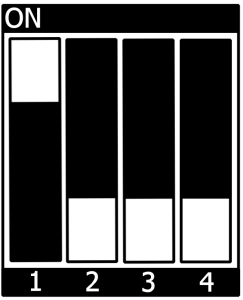

.. Download links
.. |dlpage-bsp| replace:: our BSP
.. _dlpage-bsp: https://www.phytec.de/bsp-download/?bsp=BSP-Yocto-NXP-i.MX8MP-PD23.1.0
.. |dlpage-product| replace:: https://www.phytec.de/produkte/system-on-modules/phycore-imx-8m-plus/#downloads
.. _dl-server: https://download.phytec.de/Software/Linux/BSP-Yocto-i.MX8MP/
.. _dl-sdk: https://download.phytec.de/Software/Linux/BSP-Yocto-i.MX8MP/BSP-Yocto-NXP-i.MX8MP-PD23.1.0/sdk/ampliphy-vendor-xwayland/
.. |link-image| replace:: https://download.phytec.de/Software/Linux/BSP-Yocto-i.MX8MP/BSP-Yocto-NXP-i.MX8MP-PD23.1.0/images/ampliphy-vendor-xwayland/phyboard-pollux-imx8mp-3/phytec-qt6demo-image-phyboard-pollux-imx8mp-3.wic
.. |link-partup-package| replace:: https://download.phytec.de/Software/Linux/BSP-Yocto-i.MX8MP/BSP-Yocto-NXP-i.MX8MP-PD23.1.0/images/ampliphy-vendor-xwayland/phyboard-pollux-imx8mp-3/phytec-qt6demo-image-phyboard-pollux-imx8mp-3.partup
.. |link-boot-tools| replace:: https://download.phytec.de/Software/Linux/BSP-Yocto-i.MX8MP/BSP-Yocto-NXP-i.MX8MP-PD23.1.0/images/ampliphy-vendor-xwayland/phyboard-pollux-imx8mp-3/imx-boot-tools/
.. _releasenotes: https://git.phytec.de/phy2octo/tree/releasenotes?h=imx8mp

.. IMX8(MP) specific
.. _overlaycallback: https://git.phytec.de/u-boot-imx/tree/board/phytec/phycore_imx8mp/phycore-imx8mp.c?h=v2022.04_2.2.2-phy5#n149

.. General Substitutions
.. |kit| replace:: **phyCORE-i.MX8M Plus Kit**
.. |kit-ram-size| replace:: 2GiB
.. |sbc| replace:: phyBOARD-Pollux
.. |soc| replace:: i.MX 8M Plus
.. |socfamily| replace:: i.MX 8
.. |som| replace:: phyCORE-i.MX8MP
.. |debug-uart| replace:: ttymxc0
.. |serial-uart| replace:: ttymxc1
.. |expansion-connector| replace:: X6

.. Linux Kernel
.. |kernel-socname| replace:: imx8mp
.. |kernel-tag| replace:: v5.15.71_2.2.2-phy3
.. |emmcdev| replace:: mmcblk2

.. Bootloader
.. |u-boot-offset| replace:: 32
.. |u-boot-offset-boot-part| replace:: 0
.. |u-boot-mmc-flash-offset| replace:: 0x40

.. IMX8(MP) specific
.. |u-boot-socname-config| replace:: IMX8MP
.. |u-boot-tag| replace:: v2022.04_2.2.2-phy5

.. Devicetree
.. |dt-carrierboard| replace:: imx8mp-phyboard-pollux-rdk
.. |dt-som| replace:: imx8mp-phycore-som
.. |dtbo-rpmsg| replace:: imx8mp-phycore-rpmsg.dtbo

.. IMX8(MP) specific
.. |dt-somnetwork| replace:: :imx-dt:`imx8mp-phycore-som.dtsi?h=v5.15.71_2.2.2-phy3#n50`

.. Yocto
.. |yocto-bootenv-link| replace:: :yocto-bootenv:`kirkstone`
.. |yocto-bsp-name| replace:: BSP-Yocto-IMX8MP
.. _yocto-bsp-name: `dl-server`_
.. |yocto-codename| replace:: kirkstone
.. |yocto-distro| replace:: ampliphy-vendor-xwayland
.. |yocto-imagename| replace:: phytec-qt6demo-image
.. |yocto-imageext| replace:: wic
.. |yocto-machinename| replace:: phyboard-pollux-imx8mp-3
.. |yocto-manifestname| replace:: BSP-Yocto-NXP-i.MX8MP-PD23.1.0
.. |yocto-manifestname-master| replace:: BSP-Yocto-Ampliphy-i.MX8MP-master
.. |yocto-manifestname-y| replace:: BSP-Yocto-NXP-i.MX8MP-PD23.1.y
.. |yocto-ref-manual| replace:: Yocto Reference Manual (kirkstone)
.. _yocto-ref-manual: https://phytec.github.io/doc-bsp-yocto/yocto/manual-index.html#kirkstone

.. Ref Substitutions
.. |ref-bootswitch| replace:: :ref:`bootmode switch (S3) <imx8mp-pd23.1.0-bootswitch>`
.. |ref-bsp-images| replace:: :ref:`BSP Images <imx8mp-pd23.1.0-images>`
.. |ref-debugusbconnector| replace:: :ref:`(X1) <imx8mp-pd23.1.0-components>`
.. |ref-dt| replace:: :ref:`device tree <imx8mp-pd23.1.0-device-tree>`
.. |ref-getting-started| replace:: :ref:`Getting Started <imx8mp-pd23.1.0-getting-started>`
.. |ref-network| replace:: :ref:`Network Environment Customization <imx8mp-pd23.1.0-network>`
.. |ref-setup-network-host| replace:: :ref:`Setup Network Host <imx8mp-pd23.1.0-development>`
.. |ref-usb-otg| replace:: :ref:`X5 (upper connector) <imx8mp-pd23.1.0-components>`
.. |ref-build-uboot| replace:: :ref:`Build U-Boot <imx8mp-pd23.1.0-development-build-uboot>`

.. IMX8(MP) specific
.. |pollux-sbc-network| replace::
   The device tree set up for EQOS Ethernet IP core where the PHY is populated
   on the |sbc| can be found here:
   :imx-dt:`imx8mp-phyboard-pollux-rdk.dts?h=v5.15.71_2.2.2-phy3#n150`.
.. |pollux-fan-note| replace::
   Starting with BSP-Yocto-i.MX8MP-PD22.1.1 we have to switch from PWM fan
   to GPIO fan due to availability. The PWM fan will not be supported
   anymore and will not function with the new release.

.. |ref-serial| replace:: :ref:`X2 <imx8mp-pd23.1.0-components>`
.. |ref-jp3| replace:: :ref:`JP3 <imx8mp-pd23.1.0-components>`
.. |ref-jp4| replace:: :ref:`JP4 <imx8mp-pd23.1.0-components>`
.. |ubootexternalenv| replace:: U-boot External Environment subsection of the
   :ref:`device tree overlay section <imx8mp-pd23.1.0-ubootexternalenv>`

.. M-Core specific
.. |mcore| replace:: M7 Core
.. |mcore-zephyr-docs| replace:: https://docs.zephyrproject.org/latest/boards/phytec/mimx8mp_phyboard_pollux/doc/index.html
.. |mcore-jtag-dev| replace:: MIMX8MM6_M4
.. |mcore-sdk-version| replace:: 2.13.0

+-----------------------+----------------------+
| |soc| BSP Manual                             |
+-----------------------+----------------------+
| Document Title        | |soc| BSP Manual     |
+-----------------------+----------------------+
| Document Type         | BSP Manual           |
+-----------------------+----------------------+
| Yocto Manual          | Kirkstone            |
+-----------------------+----------------------+
| Release Date          | 2024/01/10           |
+-----------------------+----------------------+
| Is Branch of          | |soc| BSP Manual     |
+-----------------------+----------------------+

The table below shows the Compatible BSPs for this manual:

==================== ================ ================ ==========
Compatible BSP'S     BSP Release Type BSP Release Date BSP Status

==================== ================ ================ ==========
|yocto-manifestname| Major            2023/12/12       Released
==================== ================ ================ ==========

.. include:: ../../intro.rsti

Supported Hardware
------------------

On our web page, you can see all supported Machines with the available Article
Numbers for this release: |yocto-manifestname| `download <dlpage-bsp_>`_.

If you choose a specific **Machine Name** in the section **Supported Machines**,
you can see which **Article Numbers** are available under this machine and also
a short description of the hardware information. In case you only have
the **Article Number** of your hardware, you can leave the **Machine
Name** drop-down menu empty and only choose your **Article Number**. Now it
should show you the necessary **Machine Name** for your specific hardware

.. _imx8mp-pd23.1.0-components:
.. include:: components.rsti

.. +---------------------------------------------------------------------------+
.. Getting Started
.. +---------------------------------------------------------------------------+

.. _imx8mp-pd23.1.0-getting-started:
.. include:: /bsp/getting-started.rsti

First Start-up
--------------

*  To boot from an SD card, the |ref-bootswitch| needs to be set to the following
   position:

*  Insert the SD card
*  Connect the target and the host with **mirco USB** on |ref-debugusbconnector|
   debug USB
*  Power up the board

.. +---------------------------------------------------------------------------+
.. Building the BSP
.. +---------------------------------------------------------------------------+

.. include:: /bsp/building-bsp.rsti

.. _imx8mp-pd23.1.0-images:

*  **u-boot.bin**: Binary compiled U-boot bootloader (U-Boot). Not the final
   Bootloader image!
*  **oftree**: Default kernel device tree
*  **u-boot-spl.bin**: Secondary program loader (SPL)
*  **bl31-imx8mp.bin**: ARM Trusted Firmware binary
*  **lpddr4_pmu_train_2d_dmem_202006.bin,
   lpddr4_pmu_train_2d_imem_202006.bin**: DDR PHY firmware images
*  **imx-boot**: Bootloader build by imx-mkimage which includes SPL, U-Boot, ARM
   Trusted Firmware and DDR firmware. This is the final bootloader image which is
   bootable.
*  **Image**: Linux kernel image
*  **Image.config**: Kernel configuration
*  **imx8mp-phyboard-pollux-rdk*.dtb**: Kernel device tree file
*  **imx8mp-phy*.dtbo**: Kernel device tree overlay files
*  **phytec-qt6demo-image\*.tar.gz**: Root file system
*  **phytec-qt6demo-image\*.wic**: SD card image

.. +---------------------------------------------------------------------------+
.. INSTALLING THE OS
.. +---------------------------------------------------------------------------+

Installing the OS
=================

Bootmode Switch (S3)
--------------------

.. tip::

   Hardware revision baseboard: 1552.2

The |sbc| features a boot switch with four individually switchable ports to
select the phyCORE-|soc| default bootsource.

.. _imx8mp-pd23.1.0-bootswitch:
.. include:: bootmode-switch.rsti

.. include:: ../installing-os.rsti

.. +---------------------------------------------------------------------------+
.. DEVELOPMENT
.. +---------------------------------------------------------------------------+

.. _imx8mp-pd23.1.0-development:

Development
===========

.. include:: /bsp/imx8/development/netboot.rsti

.. include:: /bsp/imx8/development/uuu.rsti

.. include:: /bsp/imx8/development/standalone_build.rsti
   :end-before: .. build-uboot-marker

.. _imx8mp-pd23.1.0-development-build-uboot:
.. include:: /bsp/imx8/development/standalone_build.rsti
   :start-after: .. build-uboot-marker
   :end-before: .. build-kernel-marker

Starting with PD23.1.0 release, the phyCORE-|soc| SoMs with revision 1549.3 and
newer also support 2GHz RAM timings. These will be enabled for supported boards
automatically, but they can also be enabled or disabled manually.

Edit the file configs/phycore-|kernel-socname|\_defconfig.
The fixed RAM size with 2GHz timings will be used:

.. code-block:: kconfig

   CONFIG_TARGET_PHYCORE_IMX8MP=y
   CONFIG_PHYCORE_IMX8MP_RAM_SIZE_FIX=y
   # CONFIG_PHYCORE_IMX8MP_RAM_SIZE_1GB=y
   # CONFIG_PHYCORE_IMX8MP_RAM_SIZE_2GB=y
   # CONFIG_PHYCORE_IMX8MP_RAM_SIZE_4GB=y
   CONFIG_PHYCORE_IMX8MP_USE_2GHZ_RAM_TIMINGS=y

Choose the correct RAM size as populated on the board and uncomment the line
for this ram size. When not specifying the
``CONFIG_PHYCORE_IMX8MP_USE_2GHZ_RAM_TIMINGS`` option, the 1.5GHz timings will
be chosen by default. After saving the changes, follow the remaining steps from
|ref-build-uboot|.

.. include:: /bsp/imx8/development/standalone_build.rsti
   :start-after: .. build-kernel-marker

.. include:: /bsp/imx8/development/development_manifests.rsti

.. include:: /bsp/imx8/development/upstream_manifest.rsti

.. include:: /bsp/imx8/development/format_sd-card.rsti

.. +---------------------------------------------------------------------------+
.. DEVICE TREE
.. +---------------------------------------------------------------------------+

.. _imx8mp-pd23.1.0-device-tree:
.. include:: /bsp/device-tree.rsti

::

   imx8mp-isi-csi1.dtbo
   imx8mp-isi-csi2.dtbo
   imx8mp-isp-csi1.dtbo
   imx8mp-isp-csi2.dtbo
   imx8mp-phyboard-pollux-peb-av-010.dtbo
   imx8mp-phyboard-pollux-peb-av-012.dtbo
   imx8mp-phyboard-pollux-peb-wlbt-05.dtbo
   imx8mp-phycore-no-eth.dtbo
   imx8mp-phycore-no-rtc.dtbo
   imx8mp-phycore-no-spiflash.dtbo
   imx8mp-phycore-rpmsg.dtbo
   imx8mp-vm016-csi1.dtbo
   imx8mp-vm016-csi1-fpdlink.dtbo
   imx8mp-vm016-csi2.dtbo
   imx8mp-vm016-csi2-fpdlink.dtbo
   imx8mp-vm017-csi1.dtbo
   imx8mp-vm017-csi1-fpdlink.dtbo
   imx8mp-vm017-csi2.dtbo
   imx8mp-vm017-csi2-fpdlink.dtbo

.. _imx8mp-pd23.1.0-ubootexternalenv:
.. include:: ../dt-overlays.rsti

.. +---------------------------------------------------------------------------+
.. ACCESSING PERIPHERALS
.. +---------------------------------------------------------------------------+

.. include:: /bsp/peripherals/introduction.rsti

.. include:: ../peripherals/pin-muxing.rsti

The following is an example of the pin muxing of the UART1 device in
|dt-carrierboard|.dts:

.. code-block::

   pinctrl_uart1: uart1grp {
           fsl,pins = <
                   MX8MP_IOMUXC_UART1_RXD_UART1_DCE_RX     0x140
                   MX8MP_IOMUXC_UART1_TXD_UART1_DCE_TX     0x140
           >;
   };

The first part of the string MX8MP_IOMUXC_UART1_RXD_UART1_DCE_RX names the pad
(in this example UART1_RXD). The second part of the string (UART1_DCE_RX) is the
desired muxing option for this pad. The pad setting value (hex value on the
right) defines different modes of the pad, for example, if internal pull
resistors are activated or not. In this case, the internal resistors are
disabled.

The device tree representation for UART1 pinmuxing:
:imx-dt:`imx8mp-phyboard-pollux-rdk.dts?h=v5.15.71_2.2.2-phy3#n536`

RS232/RS485
-----------

The phyCORE-|soc| supports up to 4 UART units. On the |sbc|, TTL level signals
of UART1 (the standard console) and UART4 are routed to Silicon Labs CP2105 UART
to USB converter expansion. This USB is brought out at Micro-USB connector X1.
UART3 is at X6 (Expansion Connector) at TTL level. UART2 is connected to a
multi-protocol transceiver for RS-232 and RS-485, available at pin header
connector |ref-serial| at the RS-232 level, or at the RS-485 level. The
configuration of the multi-protocol transceiver is done by jumpers |ref-jp3| and
|ref-jp4| on the baseboard. For more information about the correct setup please
refer to the phyCORE-|soc|/|sbc| Hardware Manual section UARTs.

We use the same device tree node for RS-232 and RS-485. RS-485 mode can be
enabled with ioctl TIOCSRS485. Also, full-duplex support is also configured
using ioctls. Have a look at our small example application rs485test, which is
also included in the BSP. The jumpers |ref-jp3| and |ref-jp4| need to be set
correctly.

.. include:: /bsp/imx8/peripherals/rs232-485.rsti

The device tree representation for RS232 and RS485:
:imx-dt:`imx8mp-phyboard-pollux-rdk.dts?h=v5.15.71_2.2.2-phy3#n341`

.. _imx8mp-pd23.1.0-network:

Network
-------

|sbc|-|soc| provides two ethernet interfaces. A gigabit Ethernet is provided by our
module and board.

.. warning::

   The naming convention of the Ethernet interfaces in the hardware (ethernet0
   and ethernet1) do not align with the network interfaces (eth0 and eth1) in
   Linux. So, be aware of these differences:

   | ethernet1 = eth0
   | ethernet0 = eth1

.. include:: ../peripherals/network.rsti

.. include:: wireless-network.rsti

.. include:: ../../peripherals/wireless-network.rsti

.. note::

   If the connection fails with the error message: "Failed to connect:
   org.bluez.Error.Failed" try restarting PulseAudio with:

   .. code-block:: console

      target:~$ pulseaudio --start

.. include:: /bsp/imx-common/peripherals/sd-card.rsti

DT configuration for the MMC (SD card slot) interface can be found here:
:imx-dt:`imx8mp-phyboard-pollux-rdk.dts?h=v5.15.71_2.2.2-phy3#n380`

DT configuration for the eMMC interface can be found here:
:imx-dt:`imx8mp-phycore-som.dtsi?h=v5.15.71_2.2.2-phy3#n223`

.. include:: /bsp/peripherals/emmc.rsti

.. include:: emmc.rsti

.. include:: ../peripherals/spi-master.rsti

The definition of the SPI master node in the device tree can be found here:

:imx-dt:`imx8mp-phycore-som.dtsi?h=v5.15.71_2.2.2-phy3#n76`

.. include:: ../peripherals/gpios.rsti

.. include:: ../../peripherals/leds.rsti

Device tree configuration for the User I/O configuration can be found here:
:imx-dt:`imx8mp-phyboard-pollux-rdk.dts?h=v5.15.71_2.2.2-phy3#n229`

.. include:: /bsp/imx8/peripherals/i2c-bus.rsti

General I²C1 bus configuration (e.g. |dt-som|.dtsi):
:imx-dt:`imx8mp-phycore-som.dtsi?h=v5.15.71_2.2.2-phy3#n110`

General I²C2 bus configuration (e.g. |dt-carrierboard|.dts)
:imx-dt:`imx8mp-phyboard-pollux-rdk.dts?h=v5.15.71_2.2.2-phy3#n212`

EEPROM
------

There are two different i2c EEPROM flashes populated on |som| SoM and on the
|sbc|. Both can be used with the sysfs interface in Linux. The ID page of the
I2C EEPROM populated on the SoM is also used for board detection.

.. include:: ../peripherals/eeprom.rsti

DT representation, e.g. in phyCORE-|soc| file imx8mp-phycore-som.dtsi can be
found in our PHYTEC git:
:imx-dt:`imx8mp-phycore-som.dtsi?h=v5.15.71_2.2.2-phy3#n199`

.. include:: ../../peripherals/rtc.rsti

DT representation for I²C RTCs:
:imx-dt:`imx8mp-phycore-som.dtsi?h=v5.15.71_2.2.2-phy3#n207`

USB Host Controller
-------------------

The USB controller of the |soc| SoC provides a low-cost connectivity solution
for numerous consumer portable devices by providing a mechanism for data
transfer between USB devices with a line/bus speed of up to 4 Gbit/s (SuperSpeed
'SS'). The USB subsystem has two independent USB controller cores. Both cores
are capable of acting as a USB peripheral device or a USB host. Each is
connected to a USB 3.0 PHY.

.. include:: /bsp/peripherals/usb-host.rsti

DT representation for USB Host:
:imx-dt:`imx8mp-phyboard-pollux-rdk.dts?h=v5.15.71_2.2.2-phy3#n351`

CAN FD
------

The |sbc| two flexCAN interfaces supporting CAN FD. They are supported by the
Linux standard CAN framework which builds upon then the Linux network layer.
Using this framework, the CAN interfaces behave like an ordinary Linux network
device, with some additional features special to CAN. More information can be
found in the Linux Kernel
documentation: https://www.kernel.org/doc/html/latest/networking/can.html

.. include:: ../peripherals/canfd.rsti

Device Tree CAN configuration of |dt-carrierboard|.dts:
:imx-dt:`imx8mp-phyboard-pollux-rdk.dts?h=v5.15.71_2.2.2-phy3#n175`

.. include:: /bsp/peripherals/pcie.rsti

Device Tree PCIe configuration of |dt-carrierboard|.dts:
:imx-dt:`imx8mp-phyboard-pollux-rdk.dts?h=v5.15.71_2.2.2-phy3#n287`

Audio
-----

Playback devices supported for |sbc| are HDMI and the TI TLV320AIC3007 audio
codec on the PEB-AV-10 connector. On the AV-Connector there is a 3.5mm headset
jack with OMTP-standard and an 8-pin header. The 8-pin header contains a mono
speaker, headphones, and line in signals.

.. note::

   Using the PEB-AV-10 connector for display output along HDMI as audio output
   is not supported. The audio output device must match the video output device.

.. include:: /bsp/peripherals/audio.rsti

Device Tree Audio configuration:
:imx-dt:`overlays/imx8mp-phyboard-pollux-peb-av-010.dtso?h=v5.15.71_2.2.2-phy3#n58`

.. include:: /bsp/peripherals/video.rsti

.. include:: display.rsti

.. include:: /bsp/qt6.rsti

.. include:: /bsp/imx8/peripherals/display.rsti

Device tree description of LVDS-1 and HDMI can be found here:
:imx-dt:`imx8mp-phyboard-pollux-rdk.dts?h=v5.15.71_2.2.2-phy3#n264`
:imx-dt:`imx8mp-phyboard-pollux-rdk.dts?h=v5.15.71_2.2.2-phy3#n191`

The device tree of LVDS-0 on PEB-AV-10 can be found here:
:imx-dt:`overlays/imx8mp-phyboard-pollux-peb-av-010.dtso?h=v5.15.71_2.2.2-phy3#n133`

.. include:: ../peripherals/pm.rsti

.. include:: ../peripherals/tm.rsti

The device tree description of GPIO Fan can be found here:
:imx-dt:`imx8mp-phyboard-pollux-rdk.dts?h=v5.15.71_2.2.2-phy3#n33`

.. include:: /bsp/peripherals/watchdog.rsti

.. include:: ../peripherals/snvs-power-key.rsti

.. include:: ../peripherals/npu.rsti

.. include:: ../peripherals/isp.rsti

.. include:: ../peripherals/ocotp-ctrl.rsti

Reading the registers using ``/dev/mem`` will cause the system to hang unless the
*ocotp_root_clk* is enabled. To enable this clock permanent, add to the device
tree:

.. code-block::

   &clk {
           init-on-array = <IMX8MP_CLK_OCOTP_ROOT>;
   };

.. +---------------------------------------------------------------------------+
.. i.MX 8M Plus M7 Core
.. +---------------------------------------------------------------------------+

.. include:: ../mcu.rsti

.. +---------------------------------------------------------------------------+
.. BSP EXTENSIONS
.. +---------------------------------------------------------------------------+

.. include:: /bsp/bsp-extensions.rsti
