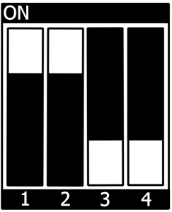

.. Download links
.. |dlpage-bsp| replace:: our BSP
.. _dlpage-bsp: https://www.phytec.de/bsp-download/?bsp=BSP-Yocto-NXP-i.MX93-PD24.2.0
.. |dlpage-product| replace:: https://www.phytec.de/produkte/system-on-modules/phycore-imx-91-93/#downloads
.. _dl-server: https://download.phytec.de/Software/Linux/BSP-Yocto-i.MX93/
.. _dl-sdk: https://download.phytec.de/Software/Linux/BSP-Yocto-i.MX93/BSP-Yocto-NXP-i.MX93-PD24.2.0/sdk/ampliphy-vendor-wayland/
.. |link-image| replace:: https://download.phytec.de/Software/Linux/BSP-Yocto-i.MX93/BSP-Yocto-NXP-i.MX93-PD24.2.0/images/ampliphy-vendor-wayland/phyboard-segin-imx93-2/phytec-qt6demo-image-phyboard-segin-imx93-2.rootfs.wic.xz
.. |link-partup-package| replace:: https://download.phytec.de/Software/Linux/BSP-Yocto-i.MX93/BSP-Yocto-NXP-i.MX93-PD24.2.0/images/ampliphy-vendor-wayland/phyboard-segin-imx93-2/phytec-qt6demo-image-phyboard-segin-imx93-2.rootfs.partup
.. |link-boot-tools| replace:: https://download.phytec.de/Software/Linux/BSP-Yocto-i.MX93/BSP-Yocto-NXP-i.MX93-PD24.2.0/images/ampliphy-vendor-wayland/phyboard-segin-imx93-2/imx-boot-tools/
.. _`static-pdf-dl`: ../../../_static/imx93-pd24.2.0.pdf

.. _releasenotes: https://git.phytec.de/phy2octo/tree/releasenotes?h=imx93

.. General Substitutions
.. |kit| replace:: **phyBOARD-Segin i.MX 93 and phyBOARD-Nash i.MX 93 Kit**
.. |kit-ram-size| replace:: 1GiB
.. |sbc| replace:: phyBOARD-Segin/Nash i.MX 93
.. |sbc-segin| replace:: phyBOARD-Segin i.MX 93
.. |sbc-nash| replace:: phyBOARD-Nash i.MX 93
.. |soc| replace:: i.MX 93
.. |socfamily| replace:: i.MX 9
.. |som| replace:: phyCORE-i.MX93
.. |debug-uart| replace:: ttyLP0
.. |serial-uart| replace:: ttyLP6
.. |expansion-connector| replace:: X16

.. Linux Kernel
.. |kernel-defconfig| replace:: imx9_phytec_defconfig
.. |kernel-recipe-path| replace:: meta-phytec/recipes-kernel/linux/linux-phytec-imx_*.bb
.. |kernel-repo-name| replace:: linux-phytec-imx
.. |kernel-repo-url| replace:: git://github.com/phytec/linux-phytec-imx.git
.. |kernel-socname| replace:: imx93
.. |kernel-tag| replace:: v6.6.23-2.0.0-phy8
.. |emmcdev| replace:: mmcblk0

.. Bootloader
.. |u-boot-offset| replace:: 32
.. |u-boot-offset-boot-part| replace:: 0
.. |u-boot-mmc-flash-offset| replace:: 0x40
.. |u-boot-emmc-devno| replace:: 0
.. |u-boot-defconfig| replace:: imx93-phycore_defconfig
.. |u-boot-multiple-defconfig-note| replace:: In command above replace ``<defconfig>`` with ``imx93-phycore_defconfig``
.. |u-boot-multiple-dtb-note| replace:: In command above replace ``<dtb>`` with ``imx93-phyboard-segin.dtb``
.. |u-boot-imx-mkimage-tag| replace:: lf-6.6.23-2.0.0
.. |u-boot-soc-name| replace:: iMX9
.. |u-boot-recipe-path| replace:: meta-phytec/recipes-bsp/u-boot/u-boot-imx_*.bb
.. |u-boot-repo-name| replace:: u-boot-imx
.. |u-boot-repo-url| replace:: git://git.phytec.de/u-boot-imx

.. IMX93 specific
.. |u-boot-socname-config| replace:: PHYCORE_IMX93
.. |u-boot-tag| replace:: v2024.04-2.0.0-phy6

.. Devicetree
.. |dt-carrierboard| replace:: imx93-phyboard-segin
.. |dt-som| replace:: imx93-phycore-som
.. |dtbo-rpmsg| replace:: imx93-phycore-rpmsg.dtso

.. IMX93 specific
.. |dt-somnetwork| replace:: :linux-phytec-imx:`blob/v6.6.23-2.0.0-phy8/arch/arm64/boot/dts/freescale/imx93-phycore-som.dtsi#L61`

.. Yocto
.. |yocto-bootenv-link| replace:: :yocto-bootenv:`scarthgap`
.. |yocto-bsp-name| replace:: BSP-Yocto-i.MX93
.. _yocto-bsp-name: `dl-server`_
.. |yocto-codename| replace:: scarthgap
.. |yocto-distro| replace:: ampliphy-vendor-wayland
.. |yocto-imagename| replace:: phytec-qt6demo-image
.. |yocto-imageext| replace:: wic.xz
.. |yocto-machinename| replace:: phyboard-segin-imx93-2
.. |yocto-manifestname| replace:: BSP-Yocto-NXP-i.MX93-PD24.2.0
.. |yocto-ref-manual| replace:: :ref:`Yocto Reference Manual (scarthgap) <yocto-man-scarthgap>`
.. |yocto-sdk-rev| replace:: 5.0
.. |yocto-sdk-a-core| replace:: cortexa55

.. Ref Substitutions
.. |ref-bootswitch| replace:: :ref:`bootmode switch (S3) <imx93-PD24.2.0-bootswitch>`
.. |ref-bsp-images| replace:: :ref:`BSP Images <imx93-PD24.2.0-images>`
.. |ref-debugusbconnector| replace:: UART1 console on PEB-EVAL-01 for **phyBOARD-Segin** and X-37
   USB-C debug for **phyBOARD-Nash**
.. |ref-dt| replace:: :ref:`device tree <imx93-PD24.2.0-device-tree>`
.. |ref-getting-started| replace:: :ref:`Getting Started <imx93-PD24.2.0-getting-started>`
.. |ref-network| replace:: :ref:`Network Environment Customization <imx93-PD24.2.0-network>`
.. |ref-setup-network-host| replace:: :ref:`Setup Network Host <imx93-PD24.2.0-development>`
.. |ref-usb-otg| replace:: :ref:`X8 (USB micro/OTG connector) <imx93-PD24.2.0-components>`

.. IMX93 specific
.. |sbc-network| replace::
   The device tree set up for EQOS Ethernet IP core where the PHY is populated
   on the |sbc| can be found here:
   :linux-phytec-imx:`blob/v6.6.23-2.0.0-phy8/arch/arm64/boot/dts/freescale/imx93-phyboard-segin.dts#L114` or here:
   :linux-phytec-imx:`blob/v6.6.23-2.0.0-phy8/arch/arm64/boot/dts/freescale/imx93-phyboard-nash.dts#L83`.

.. |ubootexternalenv| replace:: U-boot External Environment subsection of the
   :ref:`device tree overlay section <imx93-PD24.2.0-ubootexternalenv>`

.. M-Core specific
.. |mcore| replace:: M33 Core
.. |ref-m-core-connections| replace:: :ref:`X16 <imx93-PD24.2.0-components>`
.. |mcore-jtag-dev| replace:: MIMX8MM6_M4
.. |mcore-sdk-version| replace:: 2.13.0

.. only:: html

   Documentation in pdf format: `Download <static-pdf-dl_>`_

+-----------------------+----------------------+
| |soc| BSP Manual                             |
+-----------------------+----------------------+
| Document Title        | |soc| BSP Manual     |
+-----------------------+----------------------+
| Document Type         | BSP Manual           |
+-----------------------+----------------------+
| Yocto Manual          | Scarthgap            |
+-----------------------+----------------------+
| Release Date          | 2024/10/08           |
+-----------------------+----------------------+
| Is Branch of          | |soc| BSP Manual     |
+-----------------------+----------------------+

The table below shows the Compatible BSPs for this manual:

==================== ================ ================ ==========
Compatible BSPs      BSP Release Type BSP Release Date BSP Status

==================== ================ ================ ==========
|yocto-manifestname| Major            2024/10/08       Released
==================== ================ ================ ==========

.. include:: ../../intro.rsti

Supported Hardware
------------------

On our web page, you can see all supported Machines with the available Article
Numbers for this release: |yocto-manifestname|, see `download <dlpage-bsp_>`_.

If you choose a specific **Machine Name** in the section **Supported Machines**,
you can see which **Article Numbers** are available under this machine and also
a short description of the hardware information. In case you only have
the **Article Number** of your hardware, you can leave the **Machine
Name** drop-down menu empty and only choose your **Article Number**. Now it
should show you the necessary **Machine Name** for your specific hardware.

.. tip::

   **Console examples in this BSP manual only focus on phyBOARD-Segin i.MX 93.
   Similar commands can also be executed for/on phyBOARD-Nash i.MX 93**

.. _imx93-PD24.2.0-components:
.. include:: components.rsti

.. +---------------------------------------------------------------------------+
.. Getting Started
.. +---------------------------------------------------------------------------+

.. _imx93-PD24.2.0-getting-started:
.. include:: /bsp/getting-started.rsti

First Start-up
--------------

*  To boot from an SD card, the |ref-bootswitch| needs to be set to the
   following position:

*  Insert the SD card
*  Connect the targets debug console with your host. Use |ref-debugusbconnector|.
*  Power up the board
*  Open serial/usb port with 115200 baud and 8N1 (you should see u-boot/linux
   start on the console

.. +---------------------------------------------------------------------------+
.. Building the BSP
.. +---------------------------------------------------------------------------+

.. include:: /bsp/building-bsp.rsti

.. _imx93-PD24.2.0-images:

*  **u-boot.bin**: Binary compiled U-boot bootloader (U-Boot). Not the final
   Bootloader image!
*  **oftree**: Default kernel device tree
*  **u-boot-spl.bin**: Secondary program loader (SPL)
*  **bl31-imx93.bin**: ARM Trusted Firmware binary
*  **lpddr4_dmem_1d_v202201.bin, lpddr4_dmem_2d_v202201.bin,
   lpddr4_imem_1d_v202201.bin,
   lpddr4_imem_2d_v202201.bin**: DDR PHY firmware images
*  **imx-boot**: Bootloader build by imx-mkimage which includes SPL, U-Boot, ARM
   Trusted Firmware and DDR firmware. This is the final bootloader image which
   is bootable.
*  **Image**: Linux kernel image
*  **Image.config**: Kernel configuration
*  **imx93-phyboard-*.dtb**: Kernel device tree file
*  **imx93-phy\*.dtbo**: Kernel device tree overlay files
*  **phytec-\*.tar.gz**: Root file system,
   of bitbake-image that was built.

   * **phytec-qt6demo-image-phyboard-*-imx93-*.tar.gz**: when bitbake-build
     was processed for ``phytec-qt6demo-image``
   * **phytec-headless-image-phyboard-*-imx93-*.tar.gz**: when bitbake-build
     was processed for ``phytec-headless-image``
*  **phytec-\*.rootfs.wic.xz**: Compressed bootable SD
   card image of bitbake-image that was built. Includes bootloader, DTBs, Kernel
   and Root file system.

   * **phytec-qt6demo-image-phyboard-*-imx93-*.rootfs.wic.xz**: when bitbake-build
     was processed for ``phytec-qt6demo-image``
   * **phytec-headless-image-phyboard-*-imx93-*.rootfs.wic.xz**: when bitbake-build
     was processed for ``phytec-headless-image``
*  **imx93-11x11-evk_m33_\*.bin**, binaries of demo applications for the
   Cortex-M33 MCU; can be manually loaded and started with U-Boot or Linux

.. +---------------------------------------------------------------------------+
.. INSTALLING THE OS
.. +---------------------------------------------------------------------------+

Installing the OS
=================

Bootmode Switch (S3)
--------------------

.. tip::

   Hardware revision baseboard:

   *  |sbc-segin|: 1472.5
   *  |sbc-nash|: 1616.0, 1616.1

The |sbc| features a boot switch with four individually switchable ports to
select the phyCORE-|soc| default bootsource.

.. _imx93-PD24.2.0-bootswitch:
.. include:: bootmode-switch.rsti

.. include:: ../installing-os.rsti

.. +---------------------------------------------------------------------------+
.. DEVELOPMENT
.. +---------------------------------------------------------------------------+

.. _imx93-PD24.2.0-development:

Development
===========

.. include:: ../../imx-common/development/host_network_setup.rsti
.. include:: ../../imx-common/development/netboot.rsti

Working with UUU-Tool
---------------------

The Universal Update Utility Tool (UUU-Tool) from NXP is a software to execute
on the host to load and run the bootloader on the board through SDP (Serial
Download Protocol). For detailed information visit
https://github.com/nxp-imx/mfgtools or download the `Official UUU-tool
documentation <https://community.nxp.com/pwmxy87654/attachments/pwmxy87654/imx-processors/140261/1/UUU.pdf>`_.

Host preparations for UUU-Tool Usage
....................................

*  Follow the instructions from https://github.com/nxp-imx/mfgtools#linux.

*  If you built UUU from source, add it to ``PATH``:

   This BASH command adds UUU only temporarily to ``PATH``. To add it permanently, add this line to
   ``~/.bashrc``.

   .. code-block:: console

      export PATH=~/mfgtools/uuu/:"$PATH"

*  Set udev rules (documented in ``uuu -udev``):

   .. code-block:: console

      host:~$ sudo sh -c "uuu -udev >> /etc/udev/rules.d/70-uuu.rules"
      host:~$ sudo udevadm control --reload

Get Images
..........

Download imx-boot from our server or get it from your Yocto build directory at
build/deploy/images/|yocto-machinename|/. For flashing a wic image to eMMC,
you will also need |yocto-imagename|-|yocto-machinename|.wic.

Prepare Target
..............

Set the |ref-bootswitch| to **USB Serial Download**. Also, connect USB port
|ref-usb-otg| to your host.

Starting bootloader via UUU-Tool
................................

Execute and power up the board:

.. code-block:: console

   host:~$ sudo uuu -b spl imx-boot

You can see the bootlog on the console via |ref-debugusbconnector|, as usual.

.. note::
   The default boot command when booting with UUU-Tool is set to fastboot. If
   you want to change this, please adjust the environment variable bootcmd_mfg
   in U-boot prompt with setenv bootcmd_mfg. Please note, when booting with
   UUU-tool the default environment is loaded. Saveenv has no effect. If you
   want to change the boot command permanently for UUU-boot, you need to change
   this in U-Boot code.

Flashing U-boot Image to eMMC via UUU-Tool
...........................................

.. warning::

   UUU flashes U-boot into eMMC BOOT (hardware) boot partitions, and it sets
   the BOOT_PARTITION_ENABLE in the eMMC! This is a problem since we want the
   bootloader to reside in the eMMC USER partition. Flashing next U-Boot version
   .wic image and not disabling BOOT_PARTITION_ENABLE bit will result in device
   always using U-boot saved in BOOT partitions. To fix this in U-Boot:

   .. code-block:: console
      :substitutions:

      u-boot=> mmc partconf |u-boot-emmc-devno| 0 0 0
      u-boot=> mmc partconf |u-boot-emmc-devno|
      EXT_CSD[179], PARTITION_CONFIG:
      BOOT_ACK: 0x0
      BOOT_PARTITION_ENABLE: 0x0
      PARTITION_ACCESS: 0x0

   or check :ref:`Disable booting from eMMC boot partitions <emmc-disable-boot-part>`
   from Linux.

   This way the bootloader is still flashed to eMMC BOOT partitions but it is
   not used!

   When using **partup** tool and ``.partup`` package for eMMC flashing this is
   done by default, which makes partup again superior flash option.

Execute and power up the board:

.. code-block:: console

   host:~$ sudo uuu -b emmc imx-boot

Flashing wic Image to eMMC via UUU-Tool
...........................................

Execute and power up the board:

.. code-block:: console
   :substitutions:

   host:~$ sudo uuu -b emmc_all imx-boot |yocto-imagename|-|yocto-machinename|.wic

.. include:: ../../imx-common/development/standalone_build_preface.rsti

.. warning::
   Using the SDK on older host distributions (e.g., Ubuntu 20.04 LTS) with Scarthgap NXP-based BSPs
   can cause issues when building U-Boot or Linux kernel tools for host use. If you encounter an
   "undefined reference" error, a workaround is to prepend the host's binutils to the PATH.

   .. code-block:: console

      host$ export PATH=/usr/bin:$PATH

   Run this after sourcing the SDK *environment-setup* file.

   Note, SDK issue has not been observed on newer distributions, such as Ubuntu 22.04, which appear to work
   without requiring any modifications.

.. include:: ../../imx-common/development/standalone_build_u-boot_imxmkimage.rsti
.. include:: ../../imx-common/development/standalone_build_kernel.rsti

.. include:: ../../imx-common/development/format_sd-card.rsti

.. +---------------------------------------------------------------------------+
.. DEVICE TREE
.. +---------------------------------------------------------------------------+

.. _imx93-PD24.2.0-device-tree:
.. include:: /bsp/device-tree.rsti

::

   imx93-phyboard-segin-peb-av-02.dtbo
   imx93-phyboard-segin-peb-eval-01.dtbo
   imx93-phyboard-segin-peb-wlbt-05.dtbo
   imx93-phycore-rpmsg.dtbo
   imx93-phycore-no-emmc.dtbo
   imx93-phycore-no-eth.dtbo

Available overlays for phyboard-nash-imx93-1.conf are:

::

   imx93-phyboard-nash-jtag.dtbo
   imx93-phyboard-nash-peb-av-10.dtbo
   imx93-phyboard-nash-pwm-fan.dtbo
   imx93-phyboard-nash-vm016.dtbo
   imx93-phycore-rpmsg.dtbo
   imx93-phycore-no-emmc.dtbo
   imx93-phycore-no-eth.dtbo

.. _imx93-PD24.2.0-ubootexternalenv:
.. include:: ../dt-overlays.rsti

.. +---------------------------------------------------------------------------+
.. ACCESSING PERIPHERALS
.. +---------------------------------------------------------------------------+

.. include:: /bsp/peripherals/introduction.rsti

.. include:: /bsp/imx-common/peripherals/pin-muxing.rsti

The following is an example of the pin muxing of the UART1 device in
|dt-carrierboard|.dts:

.. code-block::

   pinctrl_uart1: uart1grp {
           fsl,pins = <
                   MX93_PAD_UART1_RXD__LPUART1_RX     0x31e
                   MX93_PAD_UART1_TXD__LPUART1_TX     0x30e
           >;
   };

The first part of the string MX93_PAD_UART1_RXD__LPUART1_RX names the pad
(in this example UART1_RXD). The second part of the string (LPUART1_RX) is the
desired muxing option for this pad. The pad setting value (hex value on the
right) defines different modes of the pad, for example, if internal pull
resistors are activated or not. In this case, the internal pull up is
activated.

The device tree representation for UART1 pinmuxing:
:linux-phytec-imx:`blob/v6.6.23-2.0.0-phy8/arch/arm64/boot/dts/freescale/imx93-phyboard-segin.dts#L259`

.. _imx93-PD24.2.0-network:

Network
-------

|sbc| provides two ethernet interfaces.

*  On |sbc-segin| we have:

   *  a 100 megabit Ethernet provided by |som|
   *  and 100 megabit Ethernet provided by phyBOARD.

*  On |sbc-nash| we have:

   *  a 100 megabit Ethernet provided by |som|
   *  and 1 gigabit Ethernet provided by phyBOARD.

.. include:: /bsp/imx-common/peripherals/network.rsti

.. include:: wireless-network.rsti

.. include:: ../../peripherals/wireless-network.rsti
   :end-before: .. no-bluetooth-marker

.. include:: /bsp/imx-common/peripherals/sd-card.rsti

DT configuration for the MMC (SD card slot) interface can be found here:
:linux-phytec-imx:`blob/v6.6.23-2.0.0-phy8/arch/arm64/boot/dts/freescale/imx93-phyboard-segin.dts#L213` or here:
:linux-phytec-imx:`blob/v6.6.23-2.0.0-phy8/arch/arm64/boot/dts/freescale/imx93-phyboard-nash.dts#L202`

DT configuration for the eMMC interface can be found here:
:linux-phytec-imx:`blob/v6.6.23-2.0.0-phy8/arch/arm64/boot/dts/freescale/imx93-phycore-som.dtsi#L194` or here:

.. include:: /bsp/peripherals/emmc.rsti

.. include:: /bsp/imx-common/emmc.rsti

.. include:: ../peripherals/gpios.rsti

.. include:: /bsp/peripherals/adc.rsti

On |sbc-nash| the ADC lines are accessible on X16 expansion connector:

========= ========
ADC input X16 pin
========= ========
ADC_IN0        47
ADC_IN2        49
========= ========

.. include:: ../peripherals/leds.rsti

Device tree configuration for the User I/O configuration can be found here:
:linux-phytec-imx:`blob/v6.6.23-2.0.0-phy8/arch/arm64/boot/dts/freescale/imx93-phyboard-segin-peb-eval-01.dtso#L33`

.. include:: /bsp/imx-common/peripherals/i2c-bus.rsti

General I²C3 bus configuration (e.g. |dt-som|.dtsi):
:linux-phytec-imx:`blob/v6.6.23-2.0.0-phy8/arch/arm64/boot/dts/freescale/imx93-phycore-som.dtsi#L88`

General I²C2 bus configuration for |dt-carrierboard|.dts:
:linux-phytec-imx:`blob/v6.6.23-2.0.0-phy8/arch/arm64/boot/dts/freescale/imx93-phyboard-segin.dts#L155` or for
imx93-phyboard-nash.dts:
:linux-phytec-imx:`blob/v6.6.23-2.0.0-phy8/arch/arm64/boot/dts/freescale/imx93-phyboard-nash.dts#L113`

EEPROM
------

There are two different I2C EEPROM flashes populated on |som| SoM and on the
|sbc|. For now only the one on the |som| is enabled, and it is used for board
detection.

.. include:: ../peripherals/eeprom.rsti

DT representation, e.g. in phyCORE-|soc| file can be found in our PHYTEC git:
:linux-phytec-imx:`blob/v6.6.23-2.0.0-phy8/arch/arm64/boot/dts/freescale/imx93-phycore-som.dtsi#L172`

.. include:: ../../peripherals/rtc.rsti

DT representation for I²C RTCs:
:linux-phytec-imx:`blob/v6.6.23-2.0.0-phy8/arch/arm64/boot/dts/freescale/imx93-phyboard-segin.dts#L173` or
:linux-phytec-imx:`blob/v6.6.23-2.0.0-phy8/arch/arm64/boot/dts/freescale/imx93-phyboard-nash.dts#L122`

USB Host Controller
-------------------

The USB controller of the |soc| SoC provides a low-cost connectivity solution
for numerous consumer portable devices by providing a mechanism for data
transfer between USB devices with a line/bus speed of up to 480 Mbps (HighSpeed
'HS'). The USB subsystem has two independent USB controller cores. Both cores
are capable of acting as a USB peripheral device or a USB host, but on the |sbc|
one of them is used as a host-only port (USB-A connector).

.. include:: /bsp/peripherals/usb-host.rsti

The OTG port provides an additional pin for over-current protection, which is
not used on the |sbc|. Since it's not used, the driver part is also disabled
from within the device tree. In case this pin is used, activate this
over-current in the device tree and set the correct polarity (active high/low)
according to the device specification. For the correct setup, please refer to
the Kernel documentation under
Linux/Documentation/devicetree/bindings/usb/ci-hdrc-usb2.txt.

DT representation for USB Host:
:linux-phytec-imx:`blob/v6.6.23-2.0.0-phy8/arch/arm64/boot/dts/freescale/imx93-phyboard-segin.dts#L193` or
:linux-phytec-imx:`blob/v6.6.23-2.0.0-phy8/arch/arm64/boot/dts/freescale/imx93-phyboard-nash.dts#L181`

RS232/RS485
-----------

The |sbc-nash| i.MX 93 SoC provides one RS232/RS485 serial port.

.. warning::
   RS232 with HW flow control and RS485 are not working due to HW bug on the
   |sbc-nash| PCB revision 1616.0

.. include:: /bsp/peripherals/rs232.rsti
.. include:: /bsp/peripherals/rs485.rsti

The device tree representation for RS232 and RS485:
:linux-phytec-imx:`blob/v6.6.23-2.0.0-phy8/arch/arm64/boot/dts/freescale/imx93-phyboard-nash.dts#L174`

CAN FD
------

The |sbc| has one flexCAN interface supporting CAN FD. They are supported by the
Linux standard CAN framework which builds upon the Linux network layer. Using
this framework, the CAN interfaces behave like an ordinary Linux network device,
with some additional features special to CAN. More information can be found in
the Linux Kernel
documentation: https://www.kernel.org/doc/html/latest/networking/can.html

.. include:: ../peripherals/canfd.rsti

Device Tree CAN configuration of |dt-carrierboard|.dts:
:linux-phytec-imx:`blob/v6.6.23-2.0.0-phy8/arch/arm64/boot/dts/freescale/imx93-phyboard-segin.dts#L147` or
:linux-phytec-imx:`blob/v6.6.23-2.0.0-phy8/arch/arm64/boot/dts/freescale/imx93-phyboard-nash.dts#L105`

Audio on |sbc-segin|
--------------------

On |sbc-segin| the TI TLV320AIC3007 audio codec is used. It uses I2S
for data transmission and I2C for codec control. The audio signals available
are:

* Stereo LINE IN,
* Stereo LINE OUT,
* Output where D-Class 1W speaker can be connected

.. include:: /bsp/peripherals/audio.rsti
	:end-before: .. audio_alsa_configuration_start_label

.. include:: /bsp/peripherals/audio.rsti
   :start-after: .. audio_playback_start_label
   :end-before: .. audio_capture_start_label

If Speaker volume it too low you can increase its volume with (values 0-3):

.. code-block:: console

   target:~$ amixer -c 0 sset Class-D 3

.. hint::

   Speaker output is only mono so when stereo track is played only left channel
   will be played by speaker.

Capture
.......

``arecord`` is a command-line tool for capturing audio streams which use Line In
as the default input source.

.. code-block:: console

   target:~$ arecord -t wav -c 2 -r 44100 -f S16_LE test.wav

.. hint::

   Since playback and capture share hardware interfaces, it is not possible to
   use different sampling rates and formats for simultaneous playback and
   capture operations.

Device Tree Audio configuration:
:linux-phytec-imx:`blob/v6.6.23-2.0.0-phy8/arch/arm64/boot/dts/freescale/imx93-phyboard-segin.dts#L62`

Audio on |sbc-nash|
-------------------

.. warning::

   Due to HW bug Audio is broken on |sbc-nash| PCB revision: 1616.0

To use audio with |sbc-nash| an additional adapter for the Audio/Video
connector is needed. The PEB-AV-10 (1531.1 revision) can be bought separately to
the Kit. PEB-AV-10 is populated with a TI TLV320AIC3007 audio codec. Audio
support is done via the I2S interface and controlled via I2C.

There is a 3.5mm headset jack with OMTP standard and an 8-pin header to connect
audio devices with the AV-Connector.  The 8-pin header contains a mono speaker,
headphones, and line-in signals.

.. include:: /bsp/peripherals/audio.rsti

Device Tree Audio configuration:
:linux-phytec-imx:`blob/v6.6.23-2.0.0-phy8/arch/arm64/boot/dts/freescale/imx93-phyboard-nash-peb-av-10.dtso#L56`

.. include:: /bsp/peripherals/video.rsti

.. include:: display.rsti

.. include:: /bsp/qt6.rsti

.. include:: /bsp/imx-common/peripherals/display.rsti

The device tree of PEB-AV-02 can be found here:
:linux-phytec-imx:`blob/v6.6.23-2.0.0-phy8/arch/arm64/boot/dts/freescale/imx93-phyboard-segin-peb-av-02.dtso`

The device tree of PEB-AV-10 can be found here:
:linux-phytec-imx:`blob/v6.6.23-2.0.0-phy8/arch/arm64/boot/dts/freescale/imx93-phyboard-nash-peb-av-10.dtso`

.. include:: peripherals/pm.rsti

.. include:: ../peripherals/tm.rsti

.. include:: /bsp/peripherals/watchdog.rsti

.. include:: ../peripherals/bbnsm-power-key.rsti

.. include:: ../peripherals/pxp.rsti

.. include:: ../peripherals/ocotp-ctrl.rsti

.. include:: /bsp/imx9/imx93/peripherals/tpm.rsti

Device tree TPM configuration can be found here:
:linux-phytec-imx:`blob/v6.6.23-2.0.0-phy8/arch/arm64/boot/dts/freescale/imx93-phyboard-nash.dts#L151`

.. +---------------------------------------------------------------------------+
.. i.MX 8M Plus M7 Core
.. +---------------------------------------------------------------------------+

.. include:: ../mcu.rsti
