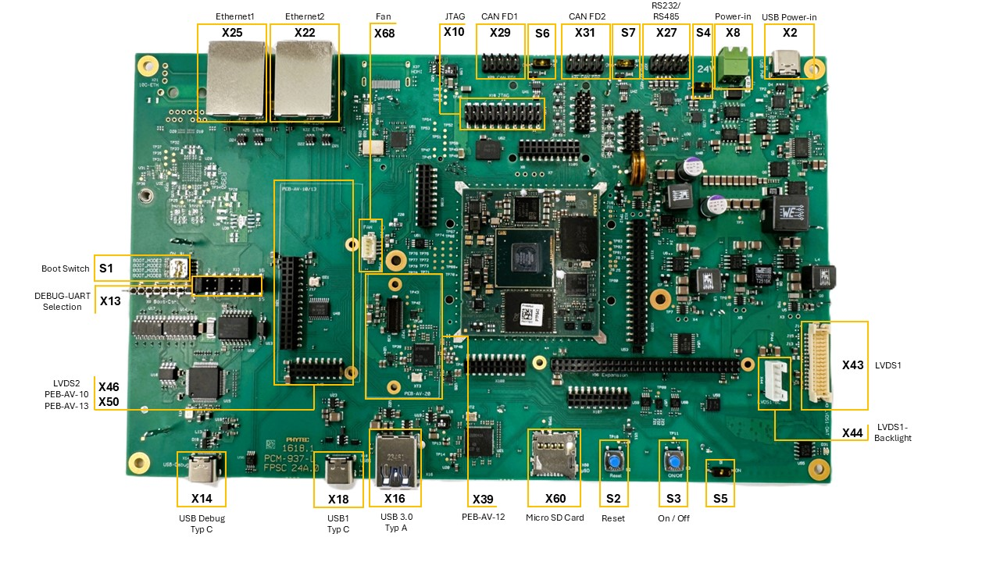
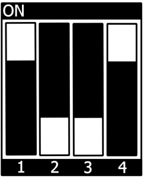

.. General Substitutions
.. |doc-id| replace:: ALPHA1
.. |kit| replace:: **phyCORE-i.MX95 FPSC Kit**
.. |soc| replace:: i.MX 95
.. |som| replace:: phyCORE-i.MX95 FPSC
.. |sbc| replace:: Libra FPSC

.. Links
.. |hardware-manual| replace:: Hardware Manual - phyCORE-i.MX 95 FPSC/Libra Development Board (1620.1/1618.0) (L-1075e.A1)
.. _hardware-manual: https://www.phytec.de/cdocuments/?doc=yYCEOQ
.. |bsp-manual| replace:: :ref:`i.MX95 ALPHA1 BSP Manual <imx95-alpha1-bsp-manual>`
.. |link-bsp-images| replace:: https://download.phytec.de/Software/Linux/BSP-Yocto-i.MX95/BSP-Yocto-NXP-i.MX95-ALPHA1/images/ampliphy-vendor/imx95-libra-fpsc-1/
.. _`static-pdf-dl`: ../../../_static/imx95-quickstart-alpha1.pdf

.. Yocto
.. |yocto-codename| replace:: scarthgap
.. |yocto-imagename| replace:: phytec-qt6demo-image
.. |yocto-manifestname| replace:: BSP-Yocto-NXP-i.MX95-ALPHA1
.. |yocto-ref-manual| replace:: :ref:`Yocto Reference Manual (scarthgap) <yocto-man-scarthgap>`

.. only:: html

   Documentation in pdf format: `Download <static-pdf-dl_>`_

+-----------------------+----------------------+
| |doc-id| |soc|        |                      |
| Quickstart Guide      |                      |
+-----------------------+----------------------+
| Document Title        | |doc-id| |soc|       |
|                       | Quickstart Guide     |
+-----------------------+----------------------+
| Document Type         | Quickstart Guide     |
+-----------------------+----------------------+
| Article Number        | |doc-id|             |
+-----------------------+----------------------+
| Yocto Manual          | Scarthgap            |
+-----------------------+----------------------+
| Release Date          | 2025/06/02           |
+-----------------------+----------------------+
| Is Branch of          | |doc-id| |soc|       |
|                       | Quickstart Guide     |
+-----------------------+----------------------+

The table below shows the Compatible BSPs for this manual:

============================== ================ ================= ==============
Compatible BSPs                BSP Release Type BSP Release  Date BSP Status

============================== ================ ================= ==============
BSP-Yocto-NXP-i.MX95-ALPHA1    Alpha            2025/06/02        Released
============================== ================ ================= ==============

Introduction
============

This Quickstart guide describes the tools and provides the know-how to install
and boot the Linux Board Support Package (BSP) for the |kit|.

This kit is currently in Alpha Status. There are several topics to keep in mind
while working with this kit and guide:

-  The |som| will go through several functional changes during the Alpha Stage of
   development. Due to this, this Quickstart guide may change without any prior notice.
-  The |som| has some functionality that is not currently operational. Please be aware
   of this when working with the Alpha Kit.
-  This Quickstart guide is only for booting and starting the basic functionality
   of the |som|.
-  Hardware manual for the |som| can be found here: |hardware-manual|_
-  Yocto Reference Manual for |yocto-codename| can be found here: |yocto-ref-manual|
-  BSP Manual for |som| can be found here: |bsp-manual|

The following manuals will be available in future releases of the |som|:

- Pin Muxing Table - a complete list of all signal chains from processor to
  carrier board output. Signal level, signal type, and other useful information
  is also included.

For more information or details regarding the |som|, please contact the PHYTEC
Sales department.

Requirements
============

Included in the Kit
-------------------

-  Alpha phyCORE-i.MX 95 FPSC SOM on Alpha Libra Development Board (PD-05032-ALPHA.A0)
-  Power adapter supplying 24 V / 3,75 A (SV071)
-  Ethernet cable (WK114)
-  USB-A to USB-C cable (WK560)
-  SD Card with prepared prebuilt images
-  2.54 10P to DB9P Female (WF072)
-  2 x 2.54 10P to DB9P Male (WF228)

Components
----------

   **Libra FPSC Components (top)**

.. figure:: images/Libra-back-components.jpg
   :align: center
   :width: 90 %

   **Libra FPSC Components (bottom)**

.. warning::
   As this is an Alpha Kit, there will be continuous revisions being made to
   the |som| SoM and |sbc| board. Due to this, components and features may not
   be available. Contact PHYTEC if there any questions regarding components and
   features for this Alpha Kit. To see which components are currently
   functional, refer to the |som| release notes.

Additional (optional) equipment (not included in Alpha Kit)
-----------------------------------------------------------

-  Display (KLCD-AC209-IMX95)
-  Embedded Imaging Kit (KPB-xxxx-Video-L01, KPB-xxxx-Video-L02)

Linux Host PC
-------------

Before you can work with the |som| Board Support Package (BSP), you will need
a host PC with the following minimum requirements:

-  A modern Linux operating host system either natively or via a virtual machine.
-  Ubuntu 22.04 LTS 64-bit recommended. Other distributions will likely work but
   note that some setup information as well as OS-specific commands and paths
   may differ.
-  VMWare Workstation, VMWare Player, and VirtualBox are possible solutions if
   you want to use a virtual machine.
-  Root access to your Linux host PC. Some commands in this guide will not work
   if you do not have sudo access (e.g. package installation, formatting an SD card).
-  At least 40 GB to 50 GB of free space on the build partition of the host PC.
-  An SD card reader, operational under Linux.
-  An active internet connection.

Connecting the Board
====================

There a few manual connections that you will need to make before using the |sbc|.

Connecting the DEBUG USB interface
----------------------------------

For the following steps, a console connection via USB is required. You can use
the included USB Type-A to USB Type-C cable.

.. note::
   For convenience, we have added a board UART to USB converter. This means,
   no RS232 interface is required during development for console communication
   between our carrier board and your host PC.

-  Connect your PC's USB port with the USB-C connector of the |sbc| (X14). After
   plugging the USB-C cable into X14 a red LED (D12) will light up to indicate a
   present USB bus voltage.
-  Your device manager will show four new COM ports. Select the first COM port.
   On the processor side, UART3 is the default debug UART of the A55 Cores. The
   second COM port is the debug UART for the M7 core. This equals to UART4 on
   the processor side.

   .. warning::
      Do not open the third or fourth COM port in a terminal program! With the
      third COM port a reset of the board can be triggered. With the fourth COM
      port the bootmodes can be set. Opening these COM ports can lead to boards
      not booting. This feature is not fully functional yet.

-  Setup your Terminal with the following parameters:
      - Speed: 115200 baud
      - Data bits: 8
      - Stop bits: 1
      - Parity: None
      - Flow control: None

Powering the Board
------------------

We recommend powering the |sbc| with the power supply (SV055) included in the
kit. Connect the power supply to the Power-In connector (X8).

.. warning::
   If you are using a power adapter other than the one provided, please note
   the polarity of the power component X8. Ensure that your power adapter is
   correctly set up to use the polarity as shown below.

   .. figure:: /bsp/imx-common/images/power-connector.png

.. warning::
   Do not power the |sbc| via USB Power-In, if populated, (X2) and Power-In (X8)
   at the same time.

.. tip::
   Be aware that as soon as the |sbc| is supplied with power, the SD Card boot
   sequence will begin. Ensure that all cables are connected to the board!

Prebuilt Images
===============

PHYTEC provides prebuild images and release notes for the |som|. They can be
downloaded here: |link-bsp-images|

There are three images available phytec-qt6demo-image, phytec-headless-image
and phytec-vision-image.

System Booting
==============

The |kit| is shipped with a pre-flashed SD card. It contains the
|yocto-imagename| and can be used directly as a boot source.

The Quickstart guide will only describe how to boot from the pre-flashed
SD card. How to build the BSP yourself, flash your own SD card or boot from
other bootsources like eMMC is described in the |bsp-manual|.

Boot with SD-Card
-----------------

*  To boot from an SD card, the bootmode switch (S1) needs to be set to the
   following position:

*  Insert the SD card
*  Connect the target and the host with **USB-C** on (X14) debug USB
*  Power up the board

