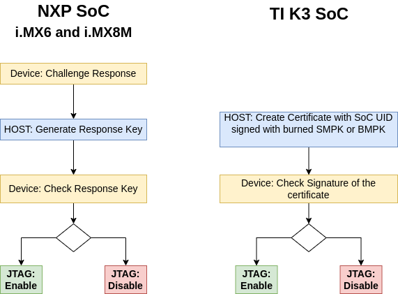

.. Download links
.. _`static-pdf-dl`: ../_static/kirkstone-sec.pdf

.. |secure-boot-link| replace:: :ref:`secure-boot-kirkstone`
.. |secure-key-storage-init-link| replace:: :ref:`secure-key-storage-init-kirkstone`
.. |secure-key-storage-link| replace:: :ref:`secure-key-storage-kirkstone`
.. |phytec-pki-link| replace:: :ref:`phytec-pki-kirkstone`

.. Yocto
.. |branding-name| replace:: Security
.. |yocto-codename| replace:: Kirkstone
.. |distro-secure-vendor| replace:: ampliphy-vendor-secure
.. |distro-secure| replace:: ampliphy-secure
.. |distro-provisioning| replace:: ampliphy-provisioning
.. |distro-provisioning-vendor| replace:: ampliphy-vendor-provisioning
.. |image-secure-name| replace:: phytec-security-image

.. only:: html

   Documentation in pdf format: `Download <static-pdf-dl_>`_

+-------------------------------------+--------------+--------------+-----------+
|| Compatible BSPs                    || BSP Release || BSP Release || Security |
||                                    || Type        || Date        || Support  |
||                                    ||             ||             || Status   |
+=====================================+==============+==============+===========+
| BSP-Yocto-Ampliphy-i.MX6-PD22.1.0   | Major        | 14.12.2022   | full      |
+-------------------------------------+--------------+--------------+-----------+
| BSP-Yocto-Ampliphy-i.MX6-PD22.1.1   | Minor        | 20.06.2023   | full      |
+-------------------------------------+--------------+--------------+-----------+
| BSP-Yocto-Ampliphy-i.MX6UL-PD22.1.0 | Major        | 11.08.2022   | full      |
+-------------------------------------+--------------+--------------+-----------+
| BSP-Yocto-Ampliphy-i.MX6UL-PD22.1.1 | Minor        | 23.05.2023   | full      |
+-------------------------------------+--------------+--------------+-----------+
| BSP-Yocto-NXP-i.MX8MM-PD23.1.0      | Major        | 12.12.2023   | full      |
+-------------------------------------+--------------+--------------+-----------+
| BSP-Yocto-NXP-i.MX8MP-PD23.1.0      | Major        | 12.12.2023   | full      |
+-------------------------------------+--------------+--------------+-----------+
| BSP-Yocto-Ampliphy-AM62x-PD23.2.0   | Major        | 28.09.2023   | partly    |
+-------------------------------------+--------------+--------------+-----------+
| BSP-Yocto-Ampliphy-AM62Ax-PD23.1.0  | Major        | 28.09.2023   | partly    |
+-------------------------------------+--------------+--------------+-----------+
| BSP-Yocto-Ampliphy-AM64x-PD23.2.0   | Major        | 28.09.2023   | partly    |
+-------------------------------------+--------------+--------------+-----------+
| BSP-Yocto-Ampliphy-AM68x-PD24.1.0   | Major        | 12.03.2024   | keywriter |
+-------------------------------------+--------------+--------------+-----------+

This manual applies to all |yocto-codename| based PHYTEC releases.

Introduction
============

PHYTEC's Yocto distribution Ampliphy (former Yogurt) supports different
security mechanism. The security features have impact on the bootloader,
the Linux kernel, Device Tree, and root filesystem.
This manual describes how security features are used and implemented on various
PHYTEC platforms. Note that different modules use different bootloaders and
flash storage devices, which affects the way things are handled. Make sure to
read the correct sections fitting your platform.

.. note::

   This manual contains machine-specific paths and variable contents. Make sure
   you are using the correct machine and device names for your application when
   executing any commands.

.. _kirkstone-security-overview:
.. include:: common/security-overview.rsti
.. include:: common/distro-using.rsti
.. _secure-boot-kirkstone:
.. include:: common/secure-boot.rsti

There are two different Yocto classes for creation of a signed FIT-image.

* PHYTEC ``sources/meta-phytec/classes/fitimage.bbclass``

   * With FIT-image recipes you can define custom, more refined FIT-images.
   * Example for FIT-image recipes are in ``sources/meta-ampliphy/recipes-images/fitimage/``
   * To create custom FIT-image, you need to specify some variables in the
     recipe:

      * FITIMAGE_SLOTS: Use this to list all slot classes for which the
        FIT-image should contain images. A value of "kernel fdt fdtapply",
        for example, will create a manifest with images for two slot classes -
        kernel and devicetree.
      * FITIMAGE_SLOT_<slotclass>: For each slot class, set this to the image
        (recipe) name which builds the artifact you intend to place in the slot
        class.
      * FITIMAGE_SLOT_<slotclass>[type]: For each slot class, set this to the
        type of image you intend to place in this slot. Possible types are the
        kernel, fdt, fdto, fdtapply, or ramdisk.
      * FITIMAGE_SLOT_<slotclass>[file]: For slot type kernel, fdt, fdt0 and
        fdtapply set this to the file of the image you intend to place in this
        slot.
      * FITIMAGE_SLOT_<slotclass>[fstype]: For slot type ramdisk, set this to
        the filesystem type of image you intend to place in this slot.
      * FITIMAGE_SLOT_<slotclass>[name]: For slot type fdtapply, set this to
        the final device tree and configuration name.

* Poky ``sources/poky/meta/classes-recipe/kernel-fitimage.bbclass``

   * This is the standard upstream FIT-image class in Yocto mainly for u-boot,
     which builts one FIT-image with initramfs and without initramfs.

Initially, the PHYTEC FIT-image class was used to create the FIT-images, because
it supports barebox and u-boot and you can define more refined FIT-images.
Since security has increasingly become an integral part of the SoC
manufacturer's BSPs, which use the kernel-fitimage, PHYTEC has decided to
gradually switch to this class, too.

Configuration Class for Signing Images
--------------------------------------
All variables to adjust the bootloader and kernel fitImage signing process can
be found in the ``source/meta-ampliphy/secureboot.bbclass``

First of all, the necessary variables for signing the bootloader for the
different SoC types need to be defined. The variable ``BOOTLOADER_SIGN`` is
obsolete, because the ``DISTRO_FEATURES="secureboot"`` includes the bootloader
signing.

.. code-block:: bash

Activate Secure Boot on the Device
==================================

The final step to activate Secure Boot on your device is to burn the secure
eFuse configuration.

.. warning::

   The secure eFuse configuration can only be written once and is irreversible!

For Secure Boot only public information are burned to SoC from NXP and TI. When
building the |distro-secure| or |distro-secure-vendor| distro for the first
time, the bootloader image is signed with PHYTEC's development keys. Yocto
stores these development keys to ``yocto/phytec-dev-ca``

.. note::
    Create and use your own keys and certificates for signing your images.
    Burn the right key into the controller's eFuse.
    Please refer to the chapter |secure-key-storage-link|

eMMC Boot Partition to Enable Boot
----------------------------------

If you install your eMMC with the partup image, then the eMMC is configured
with the right configuration. If you install the bootloader standalone on the
eMMC, then please check the eMMC configuration for the right partition.

+------------------------------+---------------------------------+-----------------------------------+
|                              | barebox                         | u-boot                            |
+==============================+=================================+===================================+
| Set eMMC as an active device | ``barebox$ detect mmc3``        | ``u-boot=> mmc dev 2``            |
+------------------------------+---------------------------------+-----------------------------------+
| Show active boot partition   | ``barebox$ devinfo mmc3``       | ``u-boot=> mmc partconf 2``       |
+------------------------------+---------------------------------+-----------------------------------+
| Set user area for boot       | ``barebox$ mmc3.boot=disabled`` | ``u-boot=> mmc partconf 2 0 7 0`` |
+------------------------------+---------------------------------+-----------------------------------+
||                             || disabled: user partition       || 0x7: user partition              |
||                             || boot0: Boot partition 0        || 0x1: Boot partition 0            |
||                             || boot1: Boot partition 1        || 0x2: Boot partition 1            |
+------------------------------+---------------------------------+-----------------------------------+

Active boot output for barebox:
   .. code-block::

      ...
      Parameters:
      boot: disabled (type: enum) (values: "disabled", "boot0", "boot1", "user")
      nt_signature: 9a54880c (type: uint32)
      probe: 0 (type: bool)

Active boot output for u-boot
   .. code-block::

      EXT_CSD[179], PARTITION_CONFIG:
      BOOT_ACK: 0x0
      BOOT_PARTITION_ENABLE: 0x1
      PARTITION_ACCESS: 0x7

Activate Secure Boot for NXP SoC
--------------------------------

For NXP SoCs you can burn the fuses with u-boot or with the tool crucible in the
kernel userspace. The necessary SRK fuses contain the hash value of the SRK
public keys. They are never used on open devices! In closed devices, they are
used to validate the public key contained in signed firmware images.
Before closing the device, you must store the hash of the public keys in the
SRK OTP bits on the device. This will allow the ROM loader to validate the
public key included in signed firmware images.

   * NXP i.MX with HAB: example ``SRK_1_2_3_4_fuse.bin`` file in
     ``yocto/phytec-dev-ca/nxp_habv4_pki/crts/SRK_1_2_3_4_fuse.bin``

If you build the signed bootloader, then the following tools are available in
the bootloader.

Check the current state of your device
......................................

   * NXP i.MX6 with HAB and bootloader barebox

   .. code-block::

      barebox$ hab -i
      Current SRK hash:
      0000000000000000000000000000000000000000000000000000000000000000
      devel mode

   * NXP i.MX8M Series with HAB and bootloader u-boot

   .. code-block::

      u-boot=> hab_status
      Secure boot disabled

      HAB Configuration: 0xf0, HAB State: 0x66
      No HAB Events Found!

Burn the SRK
............

   * NXP i.MX6 with HAB and bootloader barebox you can copy the SRK_1_2_3_4_fuse.bin
     to the device with e.g. tftp and burn directly with

   .. code-block::

      barebox$ hab -p -s SRK_1_2_3_4_fuse.bin

   * for checking the result use again

   .. code-block::

      barebox$ hab -i
      Current SRK hash:
      3425849ab41a49b07ba0b6d5e7dc92fd7cc80dc1a904bdd8e49f4e705953029b
      devel mode

   * on a SoC with u-boot you must write every word to the fuses

   +--------------------------------------------+--------------------------------------------------+
   |                                            | NXP i.MX8M Series with HAB                       |
   +============================================+==================================================+
   || ``host:~$ od -t x4 SRK_1_2_3_4_fuse.bin`` || 0000000 9a842534 b0491ab4 d5b6a07b fd92dce7     |
   ||                                           || 0000020 c10dc87c d8bd04a9 704e9fe4 9b025359     |
   +--------------------------------------------+--------------------------------------------------+
   || burn the fuses                            || ``u-boot=> fuse prog 6 0 0x9a842534``           |
   ||                                           || ``u-boot=> fuse prog 6 1 0xb0491ab4``           |
   ||                                           || ``u-boot=> fuse prog 6 2 0xd5b6a07b``           |
   ||                                           || ``u-boot=> fuse prog 6 3 0xfd92dce7``           |
   ||                                           ||                                                 |
   ||                                           || ``u-boot=> fuse prog 7 0 0xc10dc87c``           |
   ||                                           || ``u-boot=> fuse prog 7 1 0xd8bd04a9``           |
   ||                                           || ``u-boot=> fuse prog 7 2 0x704e9fe4``           |
   ||                                           || ``u-boot=> fuse prog 7 3 0x9b025359``           |
   +--------------------------------------------+--------------------------------------------------+
   || read and check                            || ``u-boot=> fuse read 6 0 4``                    |
   || the fuses                                 || 0x00000000: 9a842534 b0491ab4 d5b6a07b fd92dce7 |
   ||                                           || ``u-boot=> fuse read 7 0 4``                    |
   ||                                           || 0x00000000: c10dc87c d8bd04a9 704e9fe4 9b025359 |
   +--------------------------------------------+--------------------------------------------------+
   | reset the booard                           | ``u-boot=> reset``                               |
   +--------------------------------------------+--------------------------------------------------+
   || check the state                           || ``u-boot=> hab_status``                         |
   ||                                           ||                                                 |
   ||                                           || No Events Found!                                |
   +--------------------------------------------+--------------------------------------------------+

Lock the device
...............

.. warning::
   This step is irreversible and could brick your device.
   Before closing the device:

      * Verify you have built a signed bootloader image.
      * Reset your board and verify there are no HAB.
      * Verify the SRK eFuses have been burned correctly.

* NXP i.MX6 with HAB and bootloader barebox:

.. code-block::

   barebox$ hab -p -l
   Device successfully locked down

The device is directly locked and the SRK is write protected, too.

* SoC with u-boot:

+---------------------------+---------------------------------------+
|                           | NXP i.MX8M Series with HAB            |
+===========================+=======================================+
|| Lock your device         || ``u-boot=> fuse prog 1 3 0x2000000`` |
|| Secure Boot active       ||                                      |
+---------------------------+---------------------------------------+
| Set Read protection       | not available                         |
+---------------------------+---------------------------------------+
|| Set Over-ride protection || not available                        |
|| for shadow register      ||                                      |
+---------------------------+---------------------------------------+
|| Set Write protection     || ``u-boot=> fuse prog 0 0 0x200``     |
|| for SRK                  ||                                      |
+---------------------------+---------------------------------------+

Activate Secure Boot for TI K3 SoC
----------------------------------

You can only burn the Fuses with the OTP-Keywriter, which you have create in
the chapter |phytec-pki-link|
To run the keywriter on your hardware we recommend starting with a regular SD
card that has an unsigned image on it. Once you have your bootable SD card,
copy the ``tiboot3.bin`` you generated into the boot partition of the SD card,
replacing the previous version of the binary.

   * AM62x

   Now you must set JP8 on the development kit for AM62x in order to flash the
   keys.

   .. image:: images/phycore-am62x/pb-07124_secureboot_JP8_J28.png
      :width: 700px

   .. note::
      For some older AM62x boards you also need to verify that the resistor on J28 is set to position 2+3.

   * AM64x

    Now you must set JP5 to pins 1 and 2 on the development kit in order to flash the keys.

   .. image:: images/phycore-am64x/pb-07225_secureboot_JP5.png
      :width: 700px

Once this jumper is set, plug the SD card into the kit and boot as you normally
would. You should see a message that keywriting was successful.
The keywriter will only successfully write one time.

If you are using the incremental approach to programming your keys, it is
essential that you run your Key Revision binary after all the other binaries
have been successfully run. Writing the key revision is what converts the
device to a secure boot device, so you will not be able to run your other
binaries after the key revision is set.

Next Steps after Activation of Secure Boot
------------------------------------------

.. warning::
    After you have closed the device, consider the following points with regard
    to how firmware authentication can potentially be skipped:

    * JTAG could be used to boot the processor and avoid the secure boot.
      See :ref:`physical-security-jtag-kirkstone`
    * The bootloader will drop to a console after an unsuccessful firmware
      authentication for debugging purposes. That console can still be used to
      boot, so it should be disabled in the production firmware.
    * please check the NXP and TI websites for more information

Key Revocation
--------------

* NXP SoC: You have four keys from which you can revoke until 3 keys.
* TI K3 SoC: You have 2 keys, a SMPK and BMPK (Backup Key)

Revoke NXP SRK Key
..................

Although securing the device involves programming the hash of four public keys
into the eFuses, only one key (number 1 by default) is used in the secure boot
process. If the key gets compromised, it can be revoked and a different key
used.

To use a different key for the signature of bootloader images, change the
following variables in ``sources/meta-ampliphy/classes/secureboot.bbclass``:

.. code-block:: bash

   # for NXP with HABV4
   BOOTLOADER_SIGN_IMG_PATH ??= "${CERT_PATH}/nxp_habv4_pki/crts/IMG1_1_sha256_4096_65537_v3_usr_crt.pem"
   BOOTLOADER_SIGN_CSF_PATH ??= "${CERT_PATH}/nxp_habv4_pki/crts/CSF1_1_sha256_4096_65537_v3_usr_crt.pem"
   BOOTLOADER_HABV4_SRK_INDEX ??= "0"

The following keys are available:

+----------+----------------------+----------------------+-----------------+
| key Slot | IMG Certificate      | CSF Certificate      | SRK_REVOLE[2:0] |
+==========+======================+======================+=================+
| 0        | IMG1_1_sha256_4096_* | CSF1_1_sha256_4096_* | 001             |
+----------+----------------------+----------------------+-----------------+
| 1        | IMG2_1_sha256_4096_* | CSF2_1_sha256_4096_* | 010             |
+----------+----------------------+----------------------+-----------------+
| 2        | IMG3_1_sha256_4096_* | CSF3_1_sha256_4096_* | 100             |
+----------+----------------------+----------------------+-----------------+
| 3        | IMG4_1_sha256_4096_* | CSF4_1_sha256_4096_* | not revocable   |
+----------+----------------------+----------------------+-----------------+

Example for Revoke Key Slot 0 on NXP SoC with HABV4

+--------------------------------------------------+--------------------------------+
|| barebox                                         || u-boot                        |
|| i.MX6, i.MX6UL                                  || i.MX8M series                 |
+==================================================+================================+
| ``barebox$ mw -l -d /dev/imx-ocotp 0xBC 0x0001`` | ``u-boot=> fuse prog 9 3 0x1`` |
+--------------------------------------------------+--------------------------------+

.. note::
   * The SRK Revocation does not modify the SRK hash values, only the
     SRK_REVOKE fuse has to be programmed.
   * In a closed configuration, HAB, by default, sets the SRK_REVOKE_LOCK
     sticky bit in the OCOTP controller to write protect this eFuse field.
   * To instruct HAB not to lock the SRK_REVOKE field, the CSF commands in the
     bootloader need to be reconfigured.

.. include:: common/kernel-module-signing.rsti
.. include:: common/devicetree-overlay.rsti

.. _secure-key-storage-kirkstone:

Secure Key Storage
==================

A fundamental aspect of security is integrity and confidentiality. Many
applications require an embedded device to keep sensitive data. The standard
solution to this problem is to use encryption to protect the data and ensure
that only authorized users have access to the encryption key. When a user
interacts directly with a system, the encryption key can be protected with a
password, pin code, or fingerprint that is provided by the user. However, many
embedded devices work without user interaction, so this is not an option in
those cases.

In the BSP, three different variants of Secure Key Storage can be implemented,
depending on hardware support.
The available hardware support is activated with ``MACHINE_FEATURE``.

+---------------------+-------------------------------------+------------------+
|| Type of            || Hardware Support                   || MACHINE_FEATURE |
|| Secure Key Storage ||                                    ||                 |
+=====================+=====================================+==================+
|| NXP CAAM           || * all NXP i.MX6, i.MX6UL           || caam            |
||                    || * all i.MX8M series                ||                 |
||                    ||                                    ||                 |
+---------------------+-------------------------------------+------------------+
|| Trusted Execution  || * all NXP i.MX SoC                 || optee           |
|| Environment TEE    || * all TI K3 SoC                    ||                 |
+---------------------+-------------------------------------+------------------+
|| Trusted platform   || * on base boards for i.MX8M series || tpm             |
|| Module TPM         || * on phyGATE-Tauri-S / L           ||                 |
+---------------------+-------------------------------------+------------------+

Machines built with the ``MACHINE_FEATURE`` have all necessary prerequisites
enabled.

NXP i.MX CAAM
-------------

The NXP i.MX6, i.MX6UL and i.MX8M series processors include hardware encryption
through NXP's Cryptographic Accelerator and Assurance Module (CAAM, also known
as SEC4). The CAAM combines functions to create a modular and scalable
acceleration and assurance engine.

More information about the CAAM module can be found in the corresponding NXP
reference Manual:
`i.MX Reference Manual <https://www.nxp.com/docs/en/reference-manual/i.MX_Reference_Manual_Linux.pdf>`_

Prerequisites and Caveats
.........................

Secure Boot is required for trusted CAAM Key blob functionality. If Secure Boot
Keys are burned, the keys are locked. After a reset, the CAAM unit creates
internal keys for the signing and encryption CAAM blobs. These keys are
internal in the CAAM and can not be read out and overwritten.

Test and using
..............

You can use the CAAM unit accelerator with the cryptodev driver.

.. code-block:: console

   target:~$ openssl rand -engine devcrypto -hex 30
   target:~$ openssl ecparam -engine devcrypto -genkey -out eckey.pem -name prime256v1

Trusted Execution Environment: OP-TEE
-------------------------------------

OP-TEE is a Trusted Execution Environment (TEE) designed as a companion to a
non-secure Linux kernel running on Arm; Cortex-A cores using the TrustZone
technology.

OP-TEE is supported for the NXP i.MX8M series, NXP i.MX9 series and TI K3 SoC.
This allows users who are interested in utilizing
`OP-TEE <https://optee.readthedocs.io/en/latest/>`_ to use and test it on their
devices.

.. warning::

   If you want to use OP-TEE in production, then you must configure the
   complete isolation between the normal and secure TrustZone world.
   `For more information <https://optee.readthedocs.io/en/latest/architecture/platforms/nxp.html>`_

OP-TEE is divided into the following components:

* OP-TEE kernel: The kernel acts as a secure world OS. This kernel is signed by
  HABv4.
* tee-supplicant: Helper daemon allowing OP-TEE to read/write from/to secure
  storage. In practice, this means OP-TEE will save encrypted and authenticated
  data in the filesystem.
* xtest: Utilities to test OP-TEE.

Prerequisites and Caveats
.........................

* Secure Boot is required for OP-TEE to prevent a malicious OP-TEE kernel from
  loading.
* It is furthermore required to allow the generation of a hardware unique key
  that OP-TEE can use to derive a key for secure storage encryption and other
  use cases.
* Trusted Application Key-Pair:
  `OP-TEE signs trusted applications  <https://optee.readthedocs.io/en/latest/architecture/porting_guidelines.html#trusted-application-private-public-keypair>`_ in order to ensure their authenticity and integrity. By default, OP-TEE uses a pre-generated key, which you must replace with your own before using OP-TEE in production.

Testing OP-TEE
..............

**xtest**
   * When OP-TEE is enabled during the build, the "xtest" utility will be
     shipped.
   * Executing "xtest" will run a couple of tests supplied by the OP-TEE
     project to ensure it is working as intended.

**Memory Isolation: devmem2**
   * OP-TEE will load itself into a defined region in RAM. This region is
     reserved in Linux and does not attempt to allocate memory in this area.
   * OP-TEE modifies the device tree of Linux during startup to ensure this.
   * During runtime, the following nodes will be visible in the device tree:

   .. code-block:: console

      target:~$ dtc -I dtb -O dts /proc/device-tree
      reserved-memory {
            #address-cells = <0x02>;
            #size-cells = <0x02>;
            ranges;

            linux,cma {
                  linux,cma-default;
                  alloc-ranges = <0x00 0x40000000 0x00 0x40000000>;
                  compatible = "shared-dma-pool";
                  size = <0x00 0x28000000>;
                  reusable;
            };

            optee_shm@0x57c00000 {
                  reg = <0x00 0x57c00000 0x00 0x400000>;
                  no-map;
            };

            optee_core@0x56000000 {
                  reg = <0x00 0x56000000 0x00 0x1c00000>;
                  no-map;
            };
      };

   * optee_core denotes the secure world memory region. It is not accessible,
     even to the Linux kernel. optee_shm is the shared region between the
     normal and secure world, allowing normal-world client applications to
     exchange data with OP-TEE-trusted applications.
   * Memory access policy enforcement can be tested using the "devmem2" utility.

   .. code-block:: console

      target:~$ devmem2 0x5600000

      Memory mapped at address 0xffff88e2c000.
      Bus error

      target:~$ $?
      135

      target:~$ devmem2 0x57c00000
      /dev/mem opened.
      Memory mapped at address 0xffffb4f3c000.
      Read at address  0x57C00000 (0xffffb4f3c000): 0xA0A28501

   * In this example the 0x5600000 address is the optee_core region. Access is
     currently being blocked by the TZASC policy set up by OP-TEE, which causes
     a "Bus error". The shared region, on the other hand, is accessible.

Trusted Platform Module (TPM) 2.0
---------------------------------

The Trusted Platform Module (TPM) is an international standard for a secure
cryptoprocessor, a dedicated microcontroller designed to secure hardware
through integrated cryptographic keys.
The TPM 2.0 is:

* specified from the `Trusted Computing Group (TCG) <https://trustedcomputinggroup.org/resource/pc-client-platform-tpm-profile-ptp-specification/>`_
* TCG and Common Criteria (CC) certified EAL4+
* updateable for the Firmware
* available from different manufacturers
* used to create and store keys and certificates that can be used for
  filesystem encryption, device identification, and authentication
* a safe on the device, because the persistent keys are in the TPM and the
  key blobs can only be encrypted with the specific TPM

The Linux kernel has driver support for the TPM. TPM is the standard trusted
key in the kernel keyring service.
The `middleware for the TPM <https://github.com/tpm2-software>`_ is Open Source
and supports OpenSSL, PKCS#11, and more.
`More information about the software stack for the TPM 2.0:  <https://tpm2-software.github.io/>`_
`A practical guide for using the TPM 2.0: <https://link.springer.com/content/pdf/10.1007%2F978-1-4302-6584-9.pdf>`_

The TPM is not on the SOM, it is located on the carrier board.

Initialization of the TPM
.........................
The TPM 2.0 must be initialized at first with the command *tss2_provision*.
This command is used in the tool *physecurekeystorage-install*, when you use
the *trustedtpm* key type.

Kernel Key Retention Service for Filesystem Encryption
------------------------------------------------------

"The Linux key-management facility is primarily a way for various kernel
components to retain or cache security data, authentication keys, encryption
keys, and other data in the kernel."
Linux kernel is a kernels facility for “password caching”, which stores them in
a computers memory (RAM) during an active users/system session.
The Linux keyring accessing is via syscalls from the user space into the kernel
space. Applications to access are keyctl, systemd-ask-password and others.

The documentation about the Kernel Key Retention service can be found at `<https://www.kernel.org/doc/html/latest/security/keys/core.html>`_
The following description and implementation are based on the `<https://www.kernel.org/doc/html/latest/security/keys/trusted-encrypted.html>`_

* The kernel standard trusted key types are trusted tpm, trusted tee and
  trusted caam. The encrypted blobs are stored in the file trusted_key.blob in
  the first boot partition and in the third partition with name config.
* The secure caam is only supported in the NXP vendor based BSP and used the
  black key blob mechanism and used the kernel key type logon. The encrypted
  blobs are stored in the file  tksecure_key.

The following table list the supported key types for the different SoCs.

+-------------+------------------+-------------+-------------+-------------+
|| Key        || depend on the   || NXP        || NXP        || TI         |
|| Type       || MACHINE_FEATURE || i.MX6 (UL) || i.MX8M MNP || AM6 Series |
+=============+==================+=============+=============+=============+
| trustedtpm  | tpm2             | x           | x           | x           |
+-------------+------------------+-------------+-------------+-------------+
| trustedtee  | optee            | x           | x           | x           |
+-------------+------------------+-------------+-------------+-------------+
| trustedcaam | caam             | x (not ULL) | x           |             |
+-------------+------------------+-------------+-------------+-------------+
| securecaam  | caam             |             | x           |             |
+-------------+------------------+-------------+-------------+-------------+

.. _secure-key-storage-init-kirkstone:

Secure Key Storage Initialization with phySecureKeyStorage Tool
...............................................................

The tool `physecurekeystorage-install <https://git.phytec.de/meta-ampliphy/tree/recipes-securiphy/secure-key-storage/secure-key-storage>`_
is part of the ramdisk userspace of phytec-provisioning-initramfs and included
in the meta-ampliphy layer of the PHYTEC Standard BSP.

The *physecurekeystorage-install* tool can initialize all supported secure key
storages of your machine, but always only one can be active.
For example, the phyBOARD-Polis-imx8mm supports Trusted TEE, Trusted TPM,
Trusted CAAM and Secure CAAM, but initialized is only Trusted TPM.

.. code-block:: console

   target:~$ physecurekeystorage-install -h

   PHYTEC Install Script v1.7 for Secure Key Storage

   Usage:  physecurekeystorage-install [PARAMETER] [ACTION]

   Example:
      physecurekeystorage-install --newkeystorage trustedtpm
      physecurekeystorage-install --deletekeystorage
      physecurekeystorage-install --loadkeystorage
      physecurekeystorage-install --pkcs11testkey

   One of the following action can be selected:
      -n | --newkeystorage <value>  Create new Secure Key Storage
                              trustedcaam (only NXP controller)
                              trustedtee
                              trustedtpm
                              securecaam (black blob only NXP Vendor BSP)
      -d | --deletekeystorage Erase the existing Secure Key Storage
      -l | --loadkeystorage   Load the existing Secure Key Storage
      -p | --pkcs11testkey    Create an ECC testkey with user pin 1234
      -h | --help             This Help
      -v | --version          The version of physecurekeystorage-install

Cryptographic Token Interface PKCS#11
-------------------------------------

Also known as "Cryptoki". PKCS#11 specifies a number of standard calls to
relay cryptographic requests (such as a signing operation) to a third party
module. Such a module may be a TPM or OP-TEE, it is a software PKCS#11 trusted
application that appears to the userland as one.

The library or pkcs11-module-path for PKCS#11 depend on the device:
* TPM 2.0: /usr/lib/libtpm2_pkcs11.so.0
* OP-TEE: /usr/lib/libckteec.so.0
* SmartCards: /usr/lib/opensc-pkcs11.so

The following provider.conf is for the usage with openssl 3.0 and a TPM 2.0.
Please set the pkcs11-module-path to your selected Secure key storage.

.. code-block:: ini

   openssl_conf = openssl_init

   [openssl_init]
   providers = provider_sect

   [provider_sect]
   default = default_sect
   pkcs11 = pkcs11_sect

   [default_sect]
   activate = 1

   [pkcs11_sect]
   module = /usr/lib/ossl-modules/pkcs11.so
   pkcs11-module-path = /usr/lib/pkcs11/libtpm2_pkcs11.so
   activate = 1

If the TPM 2.0 is initialized e.g. with the tool physecurekeystorage,
then you can create a device certificate.

.. code-block:: console

   #set TPM Pin
   target:~$ TPM_PIN=1234
   # Create self-signed certificate
   target:~$ OPENSSL_CONF=provider.cnf openssl req -new -x509 -provider tpm2 -days 100 -subj '/CN=my_key/' -key "pkcs11:model=SLB9670;manufacturer=Infineon;token=test;object=test-keypair;type=private;pin-value=${TPM_PIN}" -out ecc.crt
   # Write Device Cert to TPM
   target:~$  pkcs11-tool --module /usr/lib/pkcs11/libtpm2_pkcs11.so -w ecc.crt -y cert -a iotdm-cert --pin ${TPM_PIN} -d 2

.. note::
   For device identification on a server or cloud provider, you need a
   Certificate Authority to sign the device certificate.

* You can find a more detailed example with Op-tee
  `<https://optee.readthedocs.io/en/latest/building/userland_integration.html>`_
* Examples with openssl for the TPM 2.0:
  `<https://github.com/tpm2-software/tpm2-tss-engine>`_

`OpenSSL <https://www.openssl.org/>`_ is a robust, commercial-grade,
full-featured software library for general-purpose cryptography and secure
communication.

.. include:: common/secure-storage.rsti

Boot Process Flow
-----------------

* bootloader verifies FIT-image with linux-kernel image, device tree, and
  ramdisk before they are executed
* Linux kernel executes the ramdisk (read-only filesystem)
* The bootscript loads the authenticated encrypted filesystem encryption key
  with the CAAM, TEE or TPM unit in the RAM and encrypts the filesystem. After
  the encryption, the root filesystem will be switched and the boot process
  continues.

Starting the Build Process
--------------------------

Filesystem integrity and encryption are included in the ``DISTRO_FEATURES``
``secureboot`` and ``securestorage``.

You can choose in the ``sources/meta-ampliphy/conf/distro/common-secure.inc``
between

  * ``fileauthorenc``: use integrity or encrypted filesystem
  * ``fileauthandenc``: use integrity and encrypted filesystem

This configuration is important for the RAUC update system because the use of
integrity and encrypted filesystem are stacked and the number of device-mappers
is doubled to use integrity or encrypted filesystem.

.. code-block:: bash

   DISTRO_FEATURES += "securestorage"
   #possible types: fileauthorenc , fileauthandenc
   SECURE_STORAGE_TYPE = "fileauthandenc"
   OVERRIDES_append = ":securestorage:${SECURE_STORAGE_TYPE}"

This configuration changes the RAUC ``system.conf`` configuration in the rootfs
image for the target, too. The device changes from the ``/dev/mtdblockX`` to the
device mapper ``/dev/dm-x``. With this changes the integrity and the encryption are
retained during an update.

Setup Secure Storage on your Device
-----------------------------------

The filesystem encryption ensures the target has a unique key or an equal key
per device.

The filesystem encryption process flow:

* The filesystem encryption key is generated and stored encrypted with CAAM,
  TEE, or TPM.
* Encryption is initialized.
* The partition is formatted.
* Data is copied to the encrypted partition.

First Boot
..........

From a high-level point of view, an eMMC device is like an SD card. Therefore,
it is possible to flash the image phytec-provisioning-image
from the Yocto build system directly to the SD card. The image contains the
signed bootloader and signed FIT-image with an initramfs.

If your filesystem is not initialized, is damaged, or the key blob is deleted,
then you can reinstall the encrypted filesystem with the following instructions.

* Boot the phytec-provisioning-image from the SD card or load the provisioning
  fitImage with tftp to the memory in the bootloader
* The device stops with the following message because there is no encrypted key
  stored in the folder ``/mnt/config/secrets``:

The default user is root with the password root:

.. note::

   If there is no login in 60s, then the system goes to power off

   .. code-block:: console

      Login timed out after 60 second
      [ERROR] Key and Filesystem Initialization
      The system will poweroff in 10 seconds
      reboot: Power down

* If this is your first boot from the device and no image is on the eMMC,
  please flash an image to the eMMC.

Key Generation for Secure Storage
.................................

Please follow the instructions in the chapter |secure-key-storage-link|

Secure Storage Initialization with phySecureStorage Tool
........................................................

The tool ``physecurestorage-install`` is part of the initramfs userspace of the
phytec-provisioning-image.

The ``physecurestorage-install`` tool can initialize the filesystem with encryption,
integrity, or both methods together.

.. code-block:: console

   target:~$ physecurestorage-install -h

   PHYTEC Install Script v1.5 for Secure Storage

   Usage:  physecurestorage-install [PARAMETER] [ACTION]

   Example:
   physecurestorage-install --flashpath /dev/mmcblk0
   --filesystem /media/phytec-security-image.ext4
   --flashlayout 5,6
   --newsecurestorage intenc

   One of the following action can be selected:
      -n | --newsecurestorage <value>   Create new Secure Storage of type
                              int     Root File System with integrity
                              enc     Encrypted root file system
                              intenc  Encrypted root file system with integrity
      -h | --help             This Help
      -v | --version          The version of the physecurestorage-install

   The following PARAMETER must be set for new Secure Storage:
      -p | --flashpath <flash device>
      -s | --filesystem <path to root as tgz or ext4>
      -l | --flashlayout <value>    partition number for the rootfs partitions
                           5,6       rootfs partitions are 5 and 6
      -L | --labelname <value>      label name for the partition

* The parameter <flashpath> is the eMMC device.
* The parameter <filesystem> is the path to tar.gz archive of the filesystem,
  which should be installed on the flash device.
* Please copy the filesystem image, <IMAGENAME>-<MACHINE>.tar.gz, to a USB or
  MMC drive so that it can be installed on the target. If partup packages are
  used for initial flashing, then mount the partup package as type squashfs
  first and find the root filesystem there.
* The parameter <flashlayout> contains the rootfs partition.
* The parameter RAUC initializes both RAUC rootfs partitions.
* After the installation, power off the system:

.. code-block:: console

   target:~$ poweroff -f

* Restart the system. After a successful installation, the system will boot to
  the kernel login console.

Recover an Initialized Device
.............................

If your filesystem is damaged or the key blob is deleted, then you can
reinstall the encrypted filesystem with the following options.

   1. Reinitialize your device with the phytec-provisioning-image from the SD
      card (Boot in ramdisk)
   2. Boot in rescue mode of the existing flash image with minimal tools support

The following commands are for starting the rescue mode with a booted device
from eMMC:

   * Stop booting in the bootloader. The Protection Shield Level low is in
     default with password: root
   * Add Linux bootargs in the bootloader and boot the fitImage from the eMMC:

      * for barebox (i.MX6 and i.MX6UL)

      .. code-block::

         barebox$ global linux.bootargs.rescue="rescue=1"
         barebox$ boot

      * for u-boot:

      .. code-block::

         u-boot=> run loadraucimage
         u-boot=> run raucargs
         u-boot=> setenv bootargs ${bootargs} rescue=1
         u-boot=> bootm ${loadaddr}

.. include:: common/hardening.rsti

Physical security
=================

To further protect your device, it is important to reduce attack vectors.
Start by securing development features like JTAG and serial downloader.
For activation or deactivation of controller features, is necessary to write
and read eFuses.

.. warning::

   The secure eFuse configuration can only be written once and is irreversible.

.. _physical-security-jtag-kirkstone:

Secure JTAG
-----------

Most embedded devices provide a JTAG interface for debugging purposes. However,
if left unprotected, this interface can become an important attack vector on
the systems in series production. Most controllers allow you to regulate
JTAG access with three security modes using OTP (One Time Programmable) eFuses:

+------------+-----------+----------------------------------------+-----------+-----------+
|| Mode      || Security || Description                           || NXP      || TI       |
||           || level    ||                                       || SoC      || SoC      |
+============+===========+========================================+===========+===========+
|| Enabled   || low      || This is the default mode of operation || yes      || yes      |
||           ||          || and you have full access to JTAG.     ||          ||          |
+------------+-----------+----------------------------------------+-----------+-----------+
|| Disabled  || medium   || This mode disables debugging but      ||          ||          |
|| debugging ||          || leaves the boundary scan              || yes      ||          |
||           ||          || functionality enabled.                ||          ||          |
+------------+-----------+----------------------------------------+-----------+-----------+
|| Secure    || high     || This mode provides high security.     || Secret   || X509     |
||           ||          || JTAG use is regulated by a challenge  || response || certifi- |
||           ||          || response authentication mechanism     || key      || cate     |
+------------+-----------+----------------------------------------+-----------+-----------+
|| Disabled  || high     || This mode provides maximum security.  ||          ||          |
||           ||          || All security-sensitive JTAG features  || yes      || yes      |
||           ||          || are permanently blocked, preventing   ||          ||          |
||           ||          || any debugging.                        ||          ||          |
+------------+-----------+----------------------------------------+-----------+-----------+

The NXP SoCs support different authentication depend on the SoC or the state of
the SoC

* NXP i.MX6/UL/ULL and NXP i.MX8M MNP: Secret response key is supported and can
  be activated independent of the lifecycle

The Secure Debug Mechanism with authentication differs between NXP and TI.

.. note::

   The i.MX9 family additionally supports the asymmetric signed message based
   debug enablement, which has better security compared to the password based
   mechanism (Secret response key). Secure debug can only be enabled when the
   device is in OEM_CLOSED lifecycle. In this lifecycle, only authenticated
   debug is allowed.

Additional information about JTAG Security can be found:

* NXP:
  `Secure Debug in i.MX6/7/8M Family of Application Processors AN4686 <https://www.nxp.com/webapp/Download?colCode=AN4686&location=null&isHTMLorPDF=HTML>`_
* TI: `Secure Debug User Guide <https://downloads.ti.com/tisci/esd/latest/6_topic_user_guides/secure_debug.html?highlight=jtag>`_
  or in the restricted security resources for your SoC type.

Disable Debugging Mode only for NXP SoC
.......................................

Set JTAG to "Disabled debugging" mode:

* i.MX6 and i.MX6UL/ULL with barebox:

   .. code-block::

      barebox$  mw -l -d /dev/imx-ocotp 0x18 0xC00000

* i.MX8M MNP with u-boot:

   .. code-block::

      u-boot=> fuse prog 1 3 0xC00000

Disable JTAG Mode
.................

.. note::

    **only for NXP i.MX6 family and NXP i.MX8M MNP:**

    The HAB can normally enable JTAG debugging with the HAB_JDE-bit in the
    OCOTP SCS register. The JTAG_HEO-bit can override this behavior.
    If this feature is not required, it is highly recommended this be disabled.

* NXP i.MX6 and i.MX6UL/ULL with barebox:

   .. code-block::

      # Disable JTAG Mode
      barebox$  mw -l -d /dev/imx-ocotp 0x18 0x00100000
      # To prevent HAB from Enabling JTAG
      barebox$  mw -l -d /dev/imx-ocotp 0x18 0x08000000

* NXP i.MX8M MNP with u-boot:

   .. code-block::

      # Disable JTAG Mode
      u-boot=> fuse prog 1 3 0x200000
      # To prevent HAB from Enabling JTAG
      u-boot=> fuse prog 1 3 0x4000000

Disable Serial Downloader
-------------------------

Disabling the serial download support is recommended for security-enabled
configurations:

* NXP i.MX6 with barebox:

   .. code-block::

      # Disable only Read Access for SDP
      barebox$ mw -l -d /dev/imx-ocotp 0x18 0x0004
      # Disable SDP Mode Completely
      barebox$ mw -l -d /dev/imx-ocotp 0x18 0x0001

* NXP i.MX6UL/ULL with barebox:

   .. code-block::

      # Disable only Read Access for SDP
      barebox$ mw -l -d /dev/imx-ocotp 0x18 0x40000
      # Disable SDP Mode Completely
      barebox$ mw -l -d /dev/imx-ocotp 0x18 0x20000

* NXP i.MX8M MNP with u-boot:

   .. code-block::

      # Disable SDP Mode Completely
      u-boot=> fuse prog 2 0 0x200000

Force Internal Boot
-------------------
Ensure the device always boots in INTERNAL BOOT (FORCE_BT_FROM_FUSE) mode,
ignoring BOOT_MODE pins. This setting is recommended for security-enabled
configurations.

At first you should burn the Boot Fuses.

* NXP i.MX6 with barebox:

   .. code-block::

      barebox$  mw -l -d /dev/imx-ocotp 0x18 0x80000000

* NXP i.MX6UL/ULL with barebox:

   .. code-block::

      barebox$  mw -l -d /dev/imx-ocotp 0x18 0x10000

* NXP i.MX8M MNP with u-boot:

   .. code-block::

      u-boot=> fuse prog 2 0 0x100000

Disable Boot from External Memory
---------------------------------
By writing to the DIR_BT_DIS FUSE, we can disable boot from external memory.

* NXP i.MX6 and i.MX6UL/ULL with barebox:

   .. code-block::

      barebox$ mw -l -d /dev/imx-ocotp 0x18 0x0008

* NXP i.MX8M MNP with u-boot:

   .. code-block::

      u-boot=> fuse prog 1 3 0x8000000

.. _phytec-pki-kirkstone:
.. include:: common/phytec-pki.rsti
